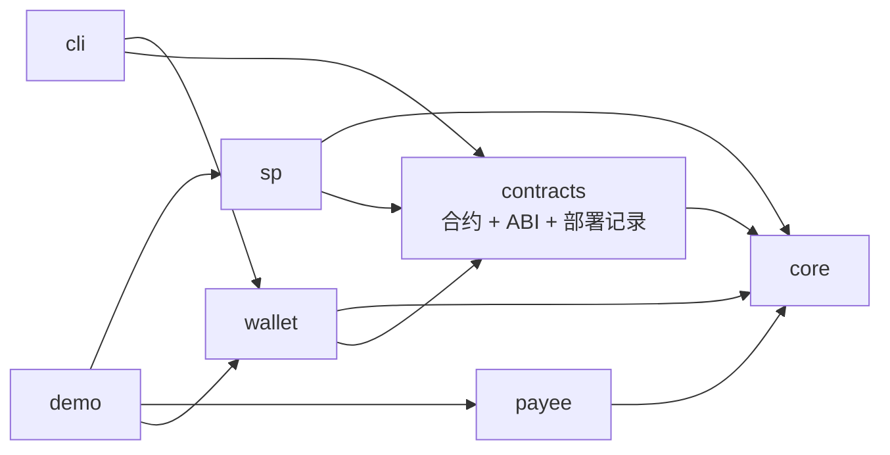
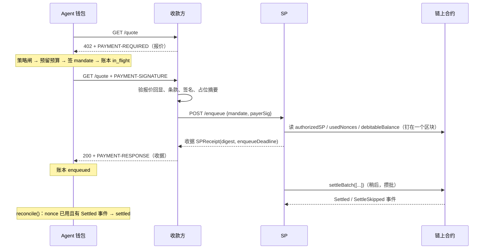

# agentpay 技术报告

> 版本：基于 `main` 提交 `d86070f`（2026-09-18）。适用读者：接入或维护这套支付系统的工程师。

## 1. 摘要

agentpay 是一套给 AI agent 用的支付系统，复刻 FluxA 的 AEP2（Agent Embedded Payment Protocol）模型：**先授权、后结算**。付款方（agent）为每次 HTTP 调用签一张一次性的 EIP-712 mandate，收款方（数据源）拿到 mandate 后立即交付，结算处理器（SP）先签一张收据承诺结算时限，稍后把多张 mandate 打成一笔 `settleBatch` 交易，从付款方预存的链上余额里扣款并付给收款方。

| 项目 | 现状 |
|---|---|
| 代码 | TypeScript ESM monorepo，6 个包 + demo；Solidity 合约 1 个（229 行） |
| 链 | 本地 Hardhat 已跑通；Base Sepolia 部署脚本就绪，未部署 |
| 测试 | 7 个工作区共 169 个测试，全绿；端到端 demo 7 个场景全过 |
| 安全 | 一轮内部安全评审，7 项修复已合入 |
| 集成 | 作为 git 子模块 `payment/` 挂在 Kairos 仓库（`KairosPan/Evolving-Alpha-US`，PR #1 待合并） |
| 不做 | escrow、争议、追索、ZK 批量证明、KYC、前端 |

## 2. 目标与范围

- **忠实复刻 AEP2 的核心**：Debit Wallet 合约、SP 批量结算、mandate 嵌在 HTTP 调用里。
- **可跑的 MVP**：四方（钱包、收款方、SP、链）都有可运行的实现，本地一条命令跑完整个流程。
- **agent 优先的接入面**：一个 CLI 和一份 SKILL.md，让 agent 不碰私钥也能看报价、查预算、付款、对账。
- **明确不做**：FluxA 协议核心之外的产品面（支付链接、卡、市场、UI），以及 recourse/escrow/dispute/ZK。

## 3. 系统架构

### 3.1 四个角色

| 角色 | 包 | 持有 | 职责 |
|---|---|---|---|
| 付款方：agent 钱包 | `packages/wallet`、`packages/cli` | 付款私钥、用户批准的预算（intent mandate）、本地账本 | 收到 402 后过策略闸、签 mandate、记账、事后对账 |
| 收款方：数据源 | `packages/payee` | 收款地址、报价 | 出 402 报价、验签、交 SP 排队、拿到收据后交付 |
| 结算处理器 SP | `packages/sp` | SP 私钥、队列 | 验 mandate、签收据、攒批上链结算 |
| 链上合约 | `packages/contracts` | 余额、已授权 SP、用过的 nonce、提现计时 | 唯一真正动钱的地方：`settle` / `settleBatch` |

`packages/core` 是四方共用的底座：Mandate 与收据的 EIP-712 类型和摘要、签名规范化、头部编解码、错误码、给 agent 看的拒绝提示、金额与 CAIP-2 工具。`demo/` 在一个进程里把四方跑一遍。

### 3.2 依赖方向



只有 `core` 没有依赖；`contracts` 只导出 ABI、部署工具和部署记录读写；运行时三方（sp、payee、wallet）互不导入，只通过 HTTP 和链交互。

### 3.3 一笔付款的时序



## 4. 协议与数据格式

### 4.1 报价（402）

收款方回 402，头 `PAYMENT-REQUIRED` 是 body 同一份 JSON 的 base64。形状对齐 x402 V2，scheme 为 `aep2`：

```json
{
  "x402Version": 2,
  "error": "mandate_required",
  "accepts": [{
    "scheme": "aep2", "network": "eip155:31337",
    "amount": "1000", "asset": "0x…usdc", "payTo": "0x…payee",
    "resource": "GET /predict", "maxTimeoutSeconds": 60,
    "extra": { "wallet": "0x…debitWallet", "sp": "http://127.0.0.1:3001",
               "spAddress": "0x…sp", "settleWindowSeconds": 10800, "quoteId": "可选" }
  }],
  "payment_model_context": { "protocol": "aep2", "reason": "mandate_required", "summary": "…", "remediation": ["…"] }
}
```

`amount` 是 USDC 原子单位（6 位小数，`1000` = $0.001）。`payment_model_context` 是给 agent 读的补救提示，每种拒绝原因一条，原文在 `packages/core/src/hints.ts`。

### 4.2 一次性 mandate

```
Mandate(address owner, address token, address payee, uint256 amount,
        uint256 nonce, uint64 deadline, bytes32 ref)
域：{ name: "AEP2DebitWallet", version: "1", chainId, verifyingContract: <wallet> }
ref = keccak256("METHOD /path") 或 keccak256("METHOD /path#quoteId")
```

- `nonce` 是付款方选的随机 uint256，合约按 `(owner, nonce)` 记录已用。
- `ref` 把资源和报价 ID 哈希进摘要，一张 mandate 只能用于这一次报价。
- 签名必须是规范的 65 字节 `(r, s, v)`，低 `s`，`v ∈ {27, 28}`。链下验证方（收款方、SP）拒绝非规范签名，使其接受集合与合约 ECDSA 完全一致；否则付款人可以拿一份可延展的签名副本被服务，却永远扣不到款。

重试请求带头 `PAYMENT-SIGNATURE`，base64 内容：

```json
{ "x402Version": 2, "accepted": { …回显的报价… },
  "payload": { "mandate": { … }, "payerSig": "0x…" } }
```

兼容 FluxA 的裸头 `X-Payment-Mandate`（base64 的 `{mandate, payerSig}`），只读不发。

### 4.3 SP 收据与成功响应

```
SPReceipt(bytes32 mandateDigest, uint64 enqueueDeadline)
域：{ name: "AEP2SettlementProcessor", version: "1", chainId, verifyingContract: <wallet> }
enqueueDeadline = min(mandate.deadline, now + settleWindowSeconds)
```

成功时收款方回 2xx，头 `PAYMENT-RESPONSE` = base64 的 `{ success: true, scheme: "aep2", network, payer, transaction: "", status: "enqueued", mandateDigest, spReceipt }`。body 不动；`includeBodyPaymentField: true` 时给 JSON 响应加 FluxA 风格的 `payment` 字段。

### 4.4 时限策略

| 谁 | 规则 |
|---|---|
| 钱包签 mandate | `deadline = now + settleWindowSeconds + max(maxTimeoutSeconds, 60)`，上限 `maxMandateValiditySeconds`（默认 24h） |
| 收款方 | `deadline ≤ now + 30s` 拒 `mandate_expired`；`deadline < now + settleWindow` 拒 `mandate_deadline_too_short` |
| SP | `deadline < now + 120s` 拒 `deadline_too_soon`；`deadline > now + 86400s` 拒 `deadline_too_far` |
| SP worker | 距 deadline 不足 30s 的 pending 项本地标 expired，不再发送 |
| 钱包对账 | `now > deadline + 60s` 且 nonce 未用 → `expired-unused`；有收据却未结算 → 记 `sp_default` |

### 4.5 错误码

| 层 | 代码 |
|---|---|
| 钱包策略拒绝（签名前） | `mandate_required` `mandate_not_found` `no_eligible_mandate` `mandate_insufficient_budget` `mandate_expired` `mandate_disabled` `host_not_allowed` `per_call_max` `rate_limited` `sp_not_trusted` `unsupported_offer` |
| 收款方拒绝（402/409） | `invalid_payment` `offer_mismatch` `invalid_payee` `invalid_token` `invalid_amount` `mandate_expired` `mandate_deadline_too_short` `invalid_ref` `invalid_signature` `replay`(409) `insufficient_balance` `nonce_used` `chain_unavailable` `settlement_unavailable` `invalid_sp_receipt` |
| SP 拒绝 | `invalid_body` `unsupported_chain` `unsupported_token` `bad_params` `deadline_too_soon` `deadline_too_far` `invalid_signature` `mandate_terminal` `nonce_used` `sp_not_authorized` `rpc_error`(503) |
| 合约 `settleBatch` 状态 | `0 Ok` `1 SPNotAuthorized` `2 Expired` `3 NonceUsed` `4 InsufficientBalance` `5 BadSignature` `6 BadParams` |

## 5. 链上合约 `AEP2DebitWallet`

Solidity 0.8.24，OpenZeppelin 5（`EIP712`、`ECDSA`、`SafeERC20`、`ReentrancyGuard`）。没有 owner、没有 admin、没有升级和暂停。

### 5.1 存储

| 映射 | 含义 |
|---|---|
| `balances[payer][token]` | 总托管额，含待提现部分 |
| `withdrawals[payer][token]` | 待提现 `{amount, unlockAt}`，每对 (payer, token) 最多一笔 |
| `usedNonces[payer][nonce]` | nonce 已消耗 |
| `authorizedSP[payer][sp]` | 该 payer 允许这个 SP 扣款 |
| `withdrawDelay`（immutable） | 提现锁定秒数，必须 ≥ 所有 SP 的结算窗口 |

### 5.2 函数

| 函数 | 说明 |
|---|---|
| `deposit(token, amount)` | 预存（需先 approve） |
| `authorizeSP(sp, enabled)` | 授权 / 撤销某个 SP |
| `requestWithdraw(token, amount)` | 开始提现计时，`unlockAt = now + withdrawDelay` |
| `cancelWithdraw(token)` | 取消待提现 |
| `executeWithdraw(token, to)` | 到期付出 `min(申请额, 剩余余额)`，锁定期内的结算优先 |
| `debitableBalance(owner, token)` | `balance − 待提现`：SP 接纳**新** mandate 的依据 |
| `mandateDigest(m)` | EIP-712 摘要，与 core 的 `mandateDigest()` 逐字节一致 |
| `settle(m, sig)` | 结算一张，失败 revert 具体错误 |
| `settleBatch(ms, sigs)` | 结算多张，单张失败**跳过并发事件** `SettleSkipped(digest, owner, nonce, status)`，只有代币转账失败才整批 revert |

`_settle` 的检查顺序：参数 → `authorizedSP[owner][msg.sender]` → deadline → nonce 未用 → **全部**余额 ≥ amount → ECDSA 恢复 == owner → 标 nonce、扣款、`Settled` 事件、`safeTransfer` 给 payee。任何人都能调用 `settleBatch`，但只对授权了调用者的 payer 生效。

### 5.3 提现安全

提现要等 `withdrawDelay`；期间已排队的 mandate 仍按**全部**余额结算，`executeWithdraw` 只付剩下的。SP 用 `debitableBalance` 接纳新 mandate，所以永远不会针对已在路上的钱接单。这与 FluxA「自动延长的提现计时器」等价，但不需要计时器。

### 5.4 Gas

本地演示：24 张 mandate 一笔 `settleBatch` 共 1,028,617 gas，每张约 42.9k。批量摊薄交易开销，每张仍要一次 ecrecover。

## 6. 结算处理器（SP）

`node:http` 服务，默认绑定 `127.0.0.1:3001`，JSONL 存储。

### 6.1 HTTP API

| 方法 路径 | 用途 |
|---|---|
| `POST /enqueue` | 提交 `{mandate, payerSig, chainId?}`；返回 `{success, status:"enqueued", created, enqueuedAt, receipt}` |
| `GET /status/:digest` | 一条记录的投影：状态、txHash、errorCode、时间戳、收据 |
| `GET /queue/:owner?token=` | 该付款人的 `balance`、`queueBalance`（已预留）、`available`、未结算列表 |
| `GET /supported` | 链、钱包合约、代币、结算窗口 |
| `GET /health` | RPC 可达性；不可达返回 503 |

### 6.2 接纳检查（`/enqueue`）

schema → 链与代币受支持 → 金额和 payee 非零 → deadline 窗口 → 规范签名并恢复为 owner → 已知摘要则幂等返回原收据（`created: false` + 原 `enqueuedAt`）→ 本地 nonce 索引 → 链上 `authorizedSP`、`usedNonces`、`debitableBalance`，三者**钉在同一区块号**读取（`cacheTime: 0`），且该区块不得早于本进程上次结算的区块，否则 503 `chain view is stale` → `debitable ≥ amount + 该 (owner, token) 已预留` → 预留、落盘、签收据。

### 6.3 队列状态机

`pending → settling → settled | failed | expired`

- worker 每 `batchIntervalMs`（默认 5000）一轮，每批最多 `batchMax`（默认 50）张，攒满立即触发。
- 一轮：(a) 距 deadline 不足 `sendMarginSeconds`（30）的本地 expired；(b) dry run 剔除合约必然跳过的项；(c) 发送，先持久化 txHash，等收据，按事件更新。
- 失败分两类：**transport**（RPC 超时、连接失败）退避 30s，不计 `attempts`，永远不会因此进入终态；**deterministic**（合约状态码）计一次，超过 `maxAttempts`（8）标 `failed:send_failed`。
- `NonceUsed` 只有在链上找到**指向这个摘要**的 `Settled` 事件时才判 `settled`（可能是本进程更早的一次尝试，或付款人授权的另一个 SP）；nonce 被别的 mandate 用掉判 `failed:nonce_used`。
- 启动恢复：崩溃时留在 `settling` 的记录，有 txHash 就查收据，否则由链上 nonce 决定，已用即落地、未用退回 pending。RPC 不可读则拒绝启动。

### 6.4 配置

环境变量：`SP_PK`、`RPC_URL`、`CHAIN_ID`、`WALLET_ADDRESS`、`SUPPORTED_TOKENS`（逗号分隔）、`SP_PORT`、`STORE_PATH`、`SETTLE_WINDOW`（10800）、`MIN_DEADLINE_MARGIN`（120）、`MAX_DEADLINE_HORIZON`（86400）、`BATCH_INTERVAL_MS`（5000）、`BATCH_MAX`（50）、`SEND_MARGIN`（30）、`MAX_ATTEMPTS`（8）。缺 `WALLET_ADDRESS` / `SUPPORTED_TOKENS` 时从 `packages/contracts/deployments/<DEPLOYMENT ?? localhost>.json` 补。

## 7. 收款方 paywall

`createMandatePaywall(options)` 返回一个普通的 `(req, res, next)` 中间件；express 只做类型引用，运行时不依赖。

八步固定顺序：

1. 读 mandate：`PAYMENT-SIGNATURE`（x402 信封）或旧头 `X-Payment-Mandate`；都没有就回 402 报价。
2. x402 信封回显的报价必须是自己的（`offer_mismatch`）。
3. 形状与条款：`payee == payTo`、`token == asset`、`amount ≥ price`、deadline 两条规则、`ref` 绑定本资源与 quoteId。
4. 签名恢复为 `owner`（非规范或畸形签名一律无效）。
5. 幂等：按摘要占位，占不到回 409 `replay`；一张 mandate 只买一次交付。
6. 可选链上预检 `debitableBalance` / `usedNonces`，RPC 出错时 fail closed（`chain_unavailable`）。默认只在 `eip155:31337` 且给了 RPC 时开启。
7. `POST <sp>/enqueue`，验收据：签名、SP 地址、摘要一致、`enqueueDeadline` 未过且不超过 `settleWindow + 时钟偏差余量`、不晚于 mandate deadline。SP 回 `created:false` 且 `enqueuedAt` 早于 60s（`REPLAY_GRACE_SECONDS`）则视为跨进程重放，回 409；60s 内视为收款方自己在 SP 超时后的重试。
8. 调 `onEnqueued`，再设置 `PAYMENT-RESPONSE` 头，最后执行路由。

关键选项：`price`（`'$0.001'`）、`network`、`asset`、`payTo`、`wallet`、`sp {url, address, settleWindowSeconds}`、`resourceOf`、`quoteIdOf`、`verifyOnChain`、`idempotencyStore`（默认进程内存，多实例换 Redis）、`includeBodyPaymentField`、`includeHints`、`deadlineMarginSeconds`。

## 8. 付款方钱包

`MandateWallet` 是一个 `fetch` 包装器加预算与账本管理。

### 8.1 预算：intent mandate

用户批准的额度，链下 EIP-712 凭证（域 `AEP2AgentWallet` v1，无 verifyingContract，合约不校验）：

```
IntentMandate(string id, string naturalLanguage, uint256 limitAmount,
              uint64 validFrom, uint64 validUntil, string hostAllowlist, string category)
```

记录字段：`limitAmount`、`spentAmount`、`pendingSpentAmount`、`perCallMax?`、`maxCallsPerMinute?`、`hostAllowlist`、`validFrom/validUntil`（最长一年）、`status: draft | signed`、`isEnabled`、`signature?`。agent 只能 `createIntentMandate` 生成 draft；`approveIntentMandate`（签名）、启用、加额都是人的操作。

### 8.2 策略闸

对每张候选预算按顺序检查，第一条不过就是答案：已签名 → 已启用 → 在有效期 → host 在白名单 → 不超单笔上限 → `limit − spent − pending ≥ amount` → 未超每分钟次数（60s 滑动窗）。自动选择时若无可用预算，按优先级 `host_not_allowed > mandate_expired > per_call_max > mandate_insufficient_budget > rate_limited > mandate_disabled` 给出原因；一张签过的都没有则是 `mandate_required`。另外报价里的 SP 不在 `trustedSps` 中拒 `sp_not_trusted`。

### 8.3 `fetch()` 流程

1. Order Mode：先请求，拿 402 报价；`prepay: true` 且有缓存报价时走 Intent Mode，第一次请求就带 mandate。
2. 策略闸 + 预算预留，**一个同步块**内完成，并发调用不会超支。
3. 构造并签 mandate；签完立刻在账本追加一行 `in_flight`。
4. 带 `PAYMENT-SIGNATURE` 重试；解析 `PAYMENT-RESPONSE`，验收据（默认 `requireReceipt: true`，无有效收据记 `unknown`）。
5. 账本更新为 `enqueued` / `rejected` / `unknown`；返回可读的 Response。

账本（JSONL）状态：`in_flight`（签完未回）、`enqueued`、`settled`、`rejected`（收款方非 2xx，签名已出，预算保持预留）、`unknown`、`expired-unused`；对账时还会记 `sp_default` 标记。

### 8.4 对账与报告

`reconcile()`：对每条未终态记录查链，nonce 已用且找到指向该摘要的 `Settled` 事件 → `settled`（带 tx）；deadline 过 60s 且 nonce 未用 → `expired-unused`，预算释放；有收据但没结算 → `sp_default`，预算释放。`report()` 输出 `SpendReport`：按状态计数、`byHost`、`byResource`、`policyDenials`（签名前被拒的记录，它们不进账本）。

### 8.5 链上操作

`deposit`、`balance`、`debitable`、`authorizeSP` / `isSpAuthorized`、`requestWithdraw` / `cancelWithdraw` / `executeWithdraw` / `pendingWithdrawal`。

## 9. CLI 与 agent 接入

`agentpay <command>`，每条命令恰好输出一份 JSON。退出码：`0` 成功，`1` 业务拒绝（读 `error` 与 `payment_model_context`），`2` 用法或配置错误。金额参数一律是美元（`5`、`0.25`、`$0.001`）。

| 组 | 命令 |
|---|---|
| 链上 | `balance` `deposit` `withdraw-request` `withdraw-cancel` `withdraw` `sp-authorize` `sp-revoke` |
| 预算 | `mandate-request`（agent 起草）`mandate-create`（人一步建好）`mandate-approve` `mandate-enable` `mandate-disable` `mandate-list` `mandate-status` |
| 付款 | `offer <url>`（只看报价）`pay <url> [--method --body --header --mandate --prepay --legacy]` `ledger` `reconcile` `report` |
| 设置 | `init [--from-deployment localhost\|base-sepolia\|path.json]` |

配置优先级：命令行参数 > `AGENTPAY_*` 环境变量 > `$AGENTPAY_HOME/config.json` > `packages/contracts/deployments/<name>.json`。私钥只从 `AGENTPAY_KEY` / `--key` 读，任何输出都不回显。`SKILL.md` 给 agent 的决策流程：先 `offer` 看价 → `mandate-list` 找可用预算 → 没有就 `mandate-request` 起草并停下等人批 → `pay` → 被拒读 `remediation`。

## 10. 安全模型与信任边界

| 谁信谁 | 内容 | 若失信 |
|---|---|---|
| 收款方 → SP | 收据是签名承诺，链上没有强制 | SP 不结算：收款方拿不到钱；钱包对账记 `sp_default` 并释放预算 |
| 付款方 → 收款方 | 入队后会交付 | 协议不给「没拿到数据就退款」，无追索 |
| SP / 收款方 → 付款方 | 余额与授权在链上可查 | 余额不足或撤销授权的 mandate 会被跳过；提现延迟保护在途 mandate |
| 用户 → 钱包程序 | 预算只在链下由钱包自己遵守 | 预算凭证合约不校验 |

评审后已合入的修复：

1. 链下验证只接受规范签名（低 `s`，`v ∈ {27,28}`），与合约 ECDSA 的接受集合一致。
2. SP 的传输失败不进终态、不计次数，30s 退避。
3. SP 接纳读链钉在同一区块，拒绝早于上次结算区块的视图（`getBlockNumber({cacheTime: 0})`）。
4. `NonceUsed` 只在有指向该摘要的 `Settled` 事件时判 settled。
5. `/enqueue` 返回 `created` / `enqueuedAt`，收款方据此把跨进程重放判 409（60s 宽限）。
6. `PAYMENT-RESPONSE` 在 `onEnqueued` 之后设置，避免处理器改写响应时丢头。
7. 钱包签完立即写 `in_flight` 账本行，崩溃后对账能找回。

未覆盖：合约未经外部审计；SP HTTP API 没有鉴权和限流；私钥以环境变量形式存在。

## 11. 可靠性与一致性

| 进程在这里崩溃 | 结果 |
|---|---|
| 钱包：签名后、发请求前 | 账本有 `in_flight`，预算已预留；对账后按链上状态收敛 |
| 收款方：入队后、交付前 | SP 已有收据会结算；付款人未拿到数据（协议不保证） |
| SP：入队后、落盘前 | 无记录、无收据；收款方收到错误不交付，可重试 |
| SP：发送后、收到收据前 | 记录停在 `settling` 带 txHash；启动恢复查收据或按 nonce 决定 |
| 钱包对账时 RPC 不可用 | 快速失败，不改任何状态 |

存储都是本地文件：SP 的 `sp-queue.jsonl`、钱包的 `mandates.json`（单写者，整文件重写）和 `ledger.jsonl`、收款方的幂等存储在内存。

## 12. 测试与验证

| 工作区 | 测试数 | 覆盖 |
|---|---|---|
| core | 22 | 摘要与合约逐字节一致、签名规范化、头部编解码、收据校验、金额解析 |
| contracts | 14 | 存取、授权、提现延迟、`settle` 各错误、`settleBatch` 跳过语义 |
| sp | 46 | 接纳各拒绝码、幂等、区块钉住、worker 状态机、启动恢复、传输失败 |
| payee | 27 | 八步顺序、重放、SP 各种坏响应（stub SP 多种模式）、链上预检 |
| wallet | 45 | 策略闸、预算并发预留、账本状态、对账（含 SP 违约、双花 nonce） |
| cli | 9 | 命令 JSON 契约、配置优先级、美元金额 |
| demo | 3 | 端到端 |

测试基础设施：每个需要链的包在 vitest global-setup 里各起一个 Hardhat 节点（端口 8546 contracts、8547 sp、8548 payee、8549 wallet），用 Hardhat 公开开发账户（#0 部署者、#1 付款人、#2 收款人、#3 SP、#4 陌生人）。demo 用 8545 / 3001 / 4021。

demo 的 7 个场景：正常付款；无头 402 报价；预算 $0.003 付三次拒第四次；重放已用 mandate；SP 拒绝；20 次调用一笔结算；提现延迟保护在途 mandate。

命令：`npm test`、`npm run demo`、`npm run typecheck`。

## 13. 部署与运维

- **本地**：`npm run deploy:local` 部署 `MockUSDC` + `AEP2DebitWallet`（`withdrawDelay` 10800），写 `packages/contracts/deployments/localhost.json`（`chainId`、`network`、`wallet`、`usdc`、`withdrawDelay`、`deployer`、`txHash`、`blockNumber`、`deployedAt`）；然后 `npm run sp`、`npm run payee`、`npm run cli -- …`。
- **Base Sepolia**：`npm run deploy:base-sepolia`，需要有测试币的 `DEPLOYER_PK`；默认 RPC `https://sepolia.base.org`，USDC 用 Circle 的 `0x036CbD53842c5426634e7929541eC2318f3dCF7e`，`WITHDRAW_DELAY` 默认 86400；写 `deployments/base-sepolia.json`。SP 还需要一个有 gas 的 `SP_PK`。
- **约束**：`WITHDRAW_DELAY` ≥ 每个 SP 的 `SETTLE_WINDOW`；SP 单进程单存储；收款方多实例需外部幂等存储；同一 `AGENTPAY_HOME` 只跑一个钱包进程。

## 14. 与 FluxA 的差异（有意为之）

1. `deadline` 用 `uint64`，`usedNonces` 按 `(owner, nonce)` 而非 `(owner, token, nonce)`；签名与 FluxA 已部署合约不互通。
2. SP 收据是 EIP-712 typed data，FluxA 是 `personal_sign` 打包字节。
3. 安全修复：`settle` 按**全部**余额检查，FluxA 参考合约的 `requestWithdraw` 立即扣减，付款人可先被服务再申请全额提现饿死结算。
4. 安全修复：SP 由每个付款人 `authorizeSP` 授权，而非部署者的全局 `setSP`；合约没有 admin。
5. 没有 ZK 批量证明：`settleBatch` 逐张链上验签；批量只摊薄交易开销。

## 15. 已知限制

- MVP，未审计；`MockUSDC` 可随意 mint；合约无手续费、无升级、无暂停。
- SP 单进程 + JSONL；收款方幂等存储在内存；跨收款方重启的重放只在 60s 宽限期外被 SP 的 `created:false` 抓住。
- 钱包预算文件单写者，两个进程共用一个 `AGENTPAY_HOME` 会互相覆盖计数。
- 没有 KYC/KYB/KYA、争议处理、支付链接、卡、市场、UI。
- 信任模型如第 10 节：SP 失约无链上强制；收款方交付无追索。
- 钱包对账不自动运行，需要显式 `reconcile`。

## 16. 与 Kairos 的集成现状

- agentpay 仓库：`https://github.com/linqizhe07/agentpay`（私有，`main` 常绿，改动走 PR）。
- Kairos 仓库 `KairosPan/Evolving-Alpha-US`：PR #1（`feat/payment` → `develop`）把 agentpay 作为子模块 `payment/` 钉在 `d86070f`，并加入 `docs/design/kairos-intro.html`（四处钱包界面的静态样例）与 `CLAUDE.md` 两行索引。
- Kairos 是付款方。agent 的接入面是 `agentpay` CLI + `SKILL.md`；`face/` 与 `dsh/` 尚未调用它。
- 分支约定：Kairos `main` 成品、`develop` 集成、每人从 develop 切分支；agentpay 只有 `main`，Kairos 的子模块指针即版本号。

## 17. 建议的后续工作

1. 在 Kairos 里真正接入：给 face 加一个持钥后端或 MCP server 包装 CLI，人批预算的卡片复用现有 `orders.ts` 审批模式。
2. Base Sepolia 部署并跑一遍 demo 场景，记录真实 gas 与结算延迟。
3. SP：加请求体大小限制与基本鉴权/限流；把 JSONL 换成可并发的存储；暴露指标。
4. 钱包：预算文件加锁或改为单进程守护；对账定时执行。
5. 合约：外部审计；考虑手续费与多 SP 场景的事件索引需求。

## 附录 A：文件索引

| 路径 | 内容 |
|---|---|
| `packages/core/src/{types,mandate,sp-receipt,headers,errors,hints,money,caip,ids}.ts` | 协议底座 |
| `packages/contracts/contracts/AEP2DebitWallet.sol` | 合约 |
| `packages/contracts/src/{abi,deploy,deployments}.ts` | 生成的 ABI、部署工具、部署记录 |
| `packages/sp/src/{server,validate,queue,store,worker,chain,receipt,config,index,main}.ts` | SP |
| `packages/payee/src/{paywall,sp-client,offer,store,chain}.ts`，`examples/express.ts` | 收款方 |
| `packages/wallet/src/{wallet,policy,mandate-store,ledger,hosts}.ts` | 钱包 |
| `packages/cli/src/{cli,config,amounts,output,context}.ts`，`commands/*`，`SKILL.md` | CLI |
| `demo/src/run-demo.ts` | 端到端演示 |
| `README.md`、`.env.example` | 用法与配置 |

## 附录 B：术语

| 术语 | 含义 |
|---|---|
| AEP2 | FluxA 的 Agent Embedded Payment Protocol：先授权后结算 |
| x402 | Coinbase 的 HTTP 402 支付协议；本项目复用其 V2 信封形状 |
| mandate | 一次性、EIP-712 签名的付款授权 |
| intent mandate | 用户批准的链下预算 |
| SP | Settlement Processor，结算处理器 |
| 收据 | SP 签名的结算承诺（`enqueueDeadline`） |
| debitable | `balance − 待提现`，SP 接纳新 mandate 的依据 |
| settleBatch | 一笔交易结算多张 mandate，单张失败跳过 |
