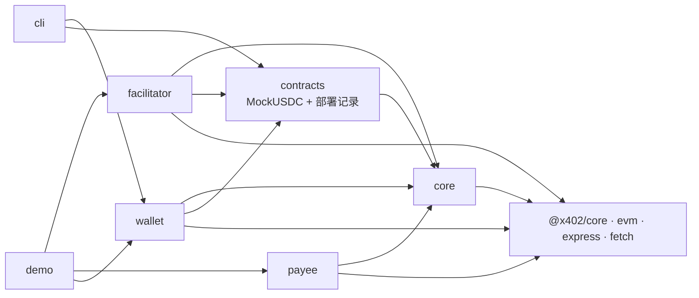
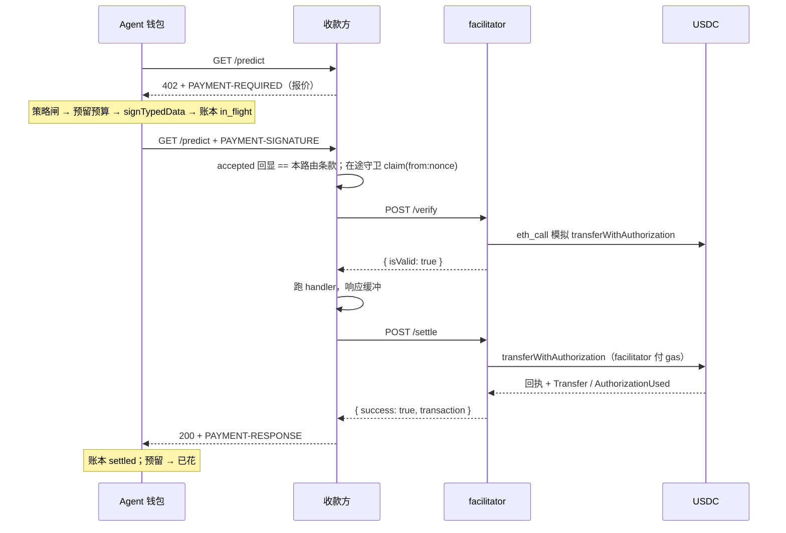

# agentpay 技术报告

> 版本：分支 `market-surface`（2026-09-21：`discover`、`pay --save`、vendor simulator、payee 结算队列与一次重试、testnet 互通脚本），基于 `main`（2026-09-19，PR #4 合并后 + Base Sepolia 实跑）。适用读者：接入或维护这套支付系统的工程师。AEP2 时代的最后一版代码在 tag `aep2-final`。

## 1. 摘要

agentpay 是一套给 AI agent 用的支付系统：协议是 Coinbase 的 **x402 V2，`exact` scheme**（EIP-3009 `transferWithAuthorization`），实现用官方 `@x402/*` 包；agentpay 自己加的是**付款方的预算层**、一个可自建的 facilitator、收款方的 paywall 封装、给 LLM agent 的 CLI + SKILL.md，以及一条本地链上跑通全流程的 demo。

一笔付款：agent 请求收费接口 → 402（`PAYMENT-REQUIRED` 头里是报价）→ 钱包过策略闸、预留预算、签一张**单次使用**的 USDC 授权 → 带 `PAYMENT-SIGNATURE` 重发 → 收款方让 facilitator 验证 → 跑业务 handler（响应先缓冲）→ facilitator 把授权广播上链、等回执 → 200 + `PAYMENT-RESPONSE`（交易哈希）。**每笔调用一笔链上交易，响应到达时钱已经到账。** 付款方只需持有 USDC，不需要 ETH、不需要存入合约、不需要 approve。

| 项目 | 现状 |
|---|---|
| 代码 | TypeScript ESM monorepo，6 个包 + demo；Solidity 只剩测试用 `MockUSDC.sol`；payee 附带一个 Massive 形状的付费数据源模拟器（`examples/vendor-sim`） |
| 协议 | x402 V2 / `exact` / EIP-3009，`@x402/core` `@x402/evm` `@x402/express` `@x402/fetch` `@x402/extensions` ~2.26.0 |
| 链 | 本地 Hardhat 全流程；Base Sepolia 无需部署（Circle USDC + 托管 facilitator 的静态记录已提交），2026-09-19 已实跑：串行每笔约 1 s，托管 facilitator 下并发会失败（§13）；2026-09-21 付通了两个不属于本仓库的 payee（§13） |
| 测试 | 7 个工作区共 262 个测试，全绿；demo 10 个场景全过 |
| 集成 | 作为 git 子模块 `payment/` 挂在 Kairos 仓库；Kairos 的 face 在进程内把 `packages/cli/src/tools.ts` 的九个工具注册给 agent，并已经通过 face 从 vendor simulator 买入 Massive 形状的日线（`wallet_pay` + `save_to`，文件落在频道的 `vendor/` 下，再进 PIT bed）（2026-09-21，分支 `feat/bought-data`） |
| 发现 | `agentpay discover` / `wallet_discover` 查公开的 CDP Bazaar 目录，只列这个钱包付得了的行（§9） |
| 不做 | V1、`upto`（只有设计稿 `docs/upto-design.md`）、Permit2、智能合约钱包签名、批量结算、争议、KYC、前端 |

## 2. 目标与范围

- **按 x402 生态来**：信封、facilitator API、客户端签名、收款方中间件都用官方实现，保证与托管 facilitator（`https://x402.org/facilitator`）和官方客户端（`@x402/fetch`）互通——demo 第 9 场景就是官方客户端付我们的 payee。
- **预算是 agentpay 的差异化**：官方客户端只管签；`MandateWallet` 只在人批过的 intent mandate 内签、签前同步预留、记账本、事后对链核对。
- **agent 优先的接入面**：一个 CLI 和一份 SKILL.md，让 agent 不碰私钥也能看报价、查预算、付款、对账。
- **明确不做**：x402 生态里的其它 scheme 与扩展，以及产品面。

## 3. 系统架构

### 3.1 四个角色

| 角色 | 包 | 持有 | 职责 |
|---|---|---|---|
| 付款方：agent 钱包 | `packages/wallet`、`packages/cli` | 付款私钥（EOA 里就是 USDC）、用户批准的预算（intent mandate）、本地账本 | 收到 402 后过策略闸、签授权、记账、事后对账 |
| 收款方：数据源 | `packages/payee` | 收款地址、报价、facilitator 地址 | 出 402 报价、让 facilitator 验证、跑 handler、让 facilitator 结算、回 `PAYMENT-RESPONSE` |
| facilitator | `packages/facilitator`（或 x402.org 托管） | facilitator 私钥（付 gas） | 验证授权、广播 `transferWithAuthorization`、等回执 |
| 链上 | `packages/contracts` | USDC（EIP-3009）：余额、`authorizationState(from, nonce)` | 唯一动钱的地方；我们没有自己的合约 |

`packages/core` 是共用底座：金额与 CAIP-2 工具、EIP-3009 ABI 切片、错误码、`payment_model_context` 提示；协议类型从 `@x402/core/types` 再导出。`demo/` 在一个进程里把四方跑一遍。

### 3.2 依赖方向



运行时三方（facilitator、payee、wallet）互不导入，只通过 HTTP 和链交互。

### 3.3 一笔付款的时序



## 4. 协议与数据格式

全部是 x402 V2 的形状，由 `@x402/core/http` 编解码；本项目在协议之外只加了两样：首次 402 的 JSON body 带 `payment_model_context`，钱包返回的 Response 带 `x-agentpay-nonce` / `x-agentpay-ledger-status`。

### 4.1 报价（402）

`PAYMENT-REQUIRED` = base64 JSON：

```
PaymentRequired { x402Version: 2, error?, resource: { url, description?, mimeType? }, accepts: PaymentRequirements[] }
PaymentRequirements { scheme: 'exact', network: 'eip155:<id>', amount, asset, payTo, maxTimeoutSeconds, extra: { name, version, assetTransferMethod: 'eip3009' } }
```

`extra.name/version` 是 token 的 EIP-712 域（MockUSDC：`Mock USD Coin`/`2`；Base Sepolia USDC：`USDC`/`2`）。`maxTimeoutSeconds` 决定授权的存活期（默认 60 s）。V2 的默认 body 是 `{}`，我们的 paywall 用 `unpaidResponseBody` 放入 `payment_model_context`。

### 4.2 单次授权

官方客户端生成并签名：

```
TransferWithAuthorization(address from, address to, uint256 value, uint256 validAfter, uint256 validBefore, bytes32 nonce)
域 { name, version, chainId, verifyingContract: asset }
from = 付款人；to = payTo；value = amount；validAfter = 0；validBefore = now + maxTimeoutSeconds；nonce = 随机 32 字节
```

`PAYMENT-SIGNATURE` = base64 `{ x402Version: 2, resource, accepted: <报价>, payload: { signature, authorization } }`。同一个 `(from, nonce)` 链上只能用一次。

### 4.3 结算响应

`PAYMENT-RESPONSE` = base64 `{ success, transaction, network, payer?, errorReason?, errorMessage? }`。成功时 `transaction` 是已上链的交易；结算失败时 `@x402/express` 回 402 且头里 `success: false` 带 `errorReason`；`settlement_pending` 表示已广播但没等到回执，带交易哈希。

### 4.4 facilitator API

`GET /supported` → `{ kinds: [{ x402Version: 2, scheme: 'exact', network }], extensions, signers }`；`POST /verify` / `POST /settle` 收 `{ x402Version: 2, paymentPayload, paymentRequirements }`，语义上的拒绝仍是 HTTP 200（`isValid: false` / `success: false`），结构错误 400 `invalid_body`，链不可达 503 + `Retry-After`。

### 4.5 错误码

以 `@x402/evm` 的实现为准（与规范文档的词汇不同）：`invalid_exact_evm_signature`、`invalid_exact_evm_recipient_mismatch`、`invalid_exact_evm_payload_authorization_valid_before` / `_valid_after` / `_value_mismatch`、`invalid_exact_evm_missing_eip712_domain`、`invalid_exact_evm_network_mismatch`、`invalid_exact_evm_insufficient_balance`、`invalid_exact_evm_nonce_already_used`、`invalid_exact_evm_transaction_simulation_failed`、`invalid_exact_evm_transaction_failed`、`asset_not_deployed_contract`、`settlement_pending`。收款方自己的：`payment_required`（首次 402）、`replay`（在途守卫）、`settlement_unavailable`（facilitator 不可达/超时/5xx）。付款方策略：`mandate_required`、`mandate_not_found`、`no_eligible_mandate`、`no_held_mandate`、`holder_mismatch`、`mandate_insufficient_budget`、`mandate_expired`、`mandate_disabled`、`host_not_allowed`、`per_call_max`、`rate_limited`、`unsupported_offer`、`timeout_too_long`。每个码都有 `payment_model_context` 提示（`core/src/hints.ts`），测试保证不漏。

## 5. 链上

没有我们自己的合约。付款方的 USDC 在它的 EOA 里，facilitator 用 `(v, r, s)` 重载调 `transferWithAuthorization`。

- `packages/contracts/contracts/MockUSDC.sol`：测试用 EIP-3009 token（`transferWithAuthorization` / `receiveWithAuthorization` / `authorizationState`，OpenZeppelin `EIP712`，域 `Mock USD Coin`/`2`，开放 `mint`）。只在本地链用。
- `deployLocalFixture()`：MockUSDC + 用 `hardhat_setCode` 放到规范地址 `0xcA11…CA11` 的 **Multicall3** 字节码——`@x402/evm` 在模拟失败后靠它诊断精确原因（余额不足、nonce 已用、域不匹配），没有它本地只能得到笼统的 `..._simulation_failed`。
- 部署记录 `DeploymentRecord { chainId, network, usdc, usdcDomain: { name, version }, facilitatorUrl?, ... }`：`localhost.json` 由 `deploy:local` 生成（gitignored）；`base-sepolia.json` 是提交的静态记录，域已按链上 `DOMAIN_SEPARATOR()` 核对。缺 `usdcDomain` 的旧记录会被 `assertDeploymentRecord` 拒绝。
- Gas：`transferWithAuthorization` 每笔约 6–10 万 gas（Base Sepolia 实测 102 828），由 facilitator 付；Base Sepolia 上一次付费调用实测约 1 s（10 笔串行：最小 675 ms、中位 934 ms、最大 1.8 s），本地 automine 约 50 ms。

## 6. facilitator

`packages/facilitator`，无状态 `node:http` 服务，核心是 `@x402/core` 的 `x402Facilitator` 加 `@x402/evm/exact/facilitator` 的 `ExactEvmScheme`，只注册 V2、一条链（直接 `register` 而不用 `registerExactEvmScheme`，后者会把 V1 也挂到它认识的所有网络上）。

- **签名器**：`privateKeyToAccount(key, { nonceManager })` + `createWalletClient(...).extend(publicActions)`，`pollingInterval` 显式设 500 ms（viem 默认按 `blockTime ?? 12 s` 取 4 s 轮询，Base 2 s 出块会白等）。`writeContract` / `sendTransaction` 包在一个**发送锁**里：viem 在 gas 估算之前就消费 nonce、任何失败都 `reset`，Hardhat automine 对乱序 nonce 报 "Nonce too high"，串行化广播（回执仍并行等）后 20 个并发结算稳定。`simulateInSettle: true`：广播前再模拟一次，revert 不消耗 nonce。
- **签名离线验证**：EOA 签名先用 viem 离线 `verifyTypedData`，只有失败时才走链上（EIP-1271/6492）；否则 RPC 一抖，scheme 会把好签名报成 `invalid_exact_evm_signature`。
- **传输错误计数**：signer 的每个链调用统计 transport 类失败；HTTP 层对比调用前后的计数，把 scheme 折叠成"拒绝"的 RPC 故障改答 **503 `unexpected_verify_error` / `unexpected_settle_error` + `Retry-After`**（`settlement_pending` 保留原样）。
- **白名单**：`tokens`（必填）与 `payees`（可选）在 `onBeforeVerify` / `onBeforeSettle` 钩子与 HTTP 层各拒一次；`/settle` 是公开端点、替人付 gas，公网上没有 `PAYEES` 等于任何人都能让它烧钱。可选 `FACILITATOR_AUTH_TOKEN`（Bearer）。
- **启动检查**：RPC 可达且 chainId 一致；每个 token 能答 `authorizationState`；`assetDomain` 与合约的 `eip712Domain()`（OpenZeppelin）或 `name()/version()/DOMAIN_SEPARATOR()`（Circle）重算一致；EOA 有 ETH。域错了启动即失败，而不是每笔 `invalid_exact_evm_signature`。
- 配置见 `.env.example`：`FACILITATOR_PK`、`RPC_URL`、`CHAIN_ID`/`SUPPORTED_TOKENS`/`USDC_DOMAIN_*`（缺省来自部署记录）、`PAYEES`、`FACILITATOR_PORT`、`RECEIPT_TIMEOUT_MS`（30 s，不是 viem 的 180 s：授权本身只活 `maxTimeoutSeconds`）。

## 7. 收款方 paywall

`createPaywall(options)` 建一个 `x402ResourceServer`（`HTTPFacilitatorClient` + `ExactEvmScheme`，一条链、V2），`charge(price, opts)` 返回 `@x402/express` 的 `paymentMiddleware`，挂在某条路由上。中间件的行为是官方的：无支付 → 402；有 → `findMatchingRequirements`（`accepted` 回显必须等于本路由条款）→ `/verify` → `next()`，`res.write/res.end` 被缓冲 → handler 状态 ≥ 400 则取消结算 → `/settle` → 设 `PAYMENT-RESPONSE` 后才把缓冲的响应发出去；结算失败 → 402（头里 `success:false`）。

agentpay 加的：

- 非默认资产（MockUSDC，或 scheme 不认识的链上的 USDC）必须以 `AssetAmount { asset, amount, extra: { name, version, assetTransferMethod } }` 报价，否则官方 server 找不到资产信息。
- **在途守卫**（`IdempotencyStore`，键 `from:nonce`，服务端 TTL = `maxTimeoutSeconds + 60`）：`onBeforeVerify` 先 `claim`，重复在途 → abort `replay`；`onAfterVerify`（`isValid:false`）/ `onVerifyFailure` / `onSettleFailure` / `onVerifiedPaymentCanceled` 释放；`onAfterSettle` 成功后 `retain`，重放不再打 facilitator。同一个 paywall 的所有路由共享一个 store，所以同一授权并发打两条同价路由也只服务一次。
- facilitator 抛出的错误（不可达、超时、5xx）在 `onVerifyFailure` / `onSettleFailure` 里 `recovered` 成干净的原因码：`settlement_unavailable`，或 facilitator 自己 5xx 里给的 `invalidReason` / `errorReason`。否则客户端看到的是异常文本。
- 首次 402 的 body：`{ x402Version: 2, error: 'payment_required', message, payment_model_context }`（`includeHints: false` 可关）。verify 失败的 402 body 固定 `{}`，原因在头的 `error` 字段——这是官方实现的行为，钱包据此读原因。
- **结算队列，每个 facilitator 一条**：`/settle` 经 `LockedFacilitatorClient`（继承官方 `HTTPFacilitatorClient`，只覆写 `settle`，所以 core 的 `settleWithPendingRetry` 和我们的重试都从它走）送进 `settleLockFor(url)`——进程级、按 facilitator URL 建的 promise 链锁，与 facilitator 自己的发送锁是同一份实现（payee 不依赖 facilitator 包，`settle-lock.ts` 是一份拷贝）。`/verify` 是读，不排队。为什么按 URL 而不是按 paywall：托管的 x402.org 用一个账户签所有结算，两笔 `/settle` 一起到它那里，它自己的 nonce 管理器就输（§13：5 并发成 2），同一进程里两个 paywall 指向同一个 facilitator 照样会互相撞。`serializeSettle: false` 退回官方客户端（并发结算，吞吐跟链走）。
- **一次重试**：`onSettleFailure` 里，原因恰好是 `invalid_exact_evm_transaction_failed`、配置了 `chainReader`、且这把 `from:nonce` 还没重试过时，先读链上 `authorizationState(from, nonce)`：**false**（钱没动）→ 等 `settleRetryDelayMs`（默认 1500 ms）再 `settle` 一次；成功则自己做 `onAfterSettle` 的活（`retain` + `onSettled`）并 `recovered` 成正常结算——EIP-3009 的 nonce 保证第二次不会重复扣款。其它情况（别的原因码、没有 RPC、nonce 已用、链读不到、已重试过）照旧释放 claim 并回失败。重试进行中 claim 不释放，同一授权的并发重放插不进来；`retried` 表的条目随授权有效期 + 60 s 过期。这个原因码本身是含糊的：转账真 revert 了，或 facilitator 输掉了自己账户 nonce 的竞争（托管 facilitator 并发时就是后者），链上状态替它分辨。
- **`rpcUrl` / `chainReader`**：`createChainReader(rpcUrl, { timeoutMs = 5000 })` 用 viem `readContract` 读 `authorizationState`，`retryCount: 0`——决定重不重试要快且诚实，RPC 抖动就当"不知道"、不重试（读挂着等于付款方的响应挂着）。给了 `chainReader` 就忽略 `rpcUrl`；两者都没有，结算失败即终局。示例 payee 读 `PAYEE_RPC_URL`，缺省按网络取（hardhat `:8545` / `sepolia.base.org`），取不到则告警。
- **`ChargeOptions.discovery`**：一条路由可以向目录（CDP Bazaar）申报自己。`DiscoveryDeclaration { input, inputSchema, pathParams, pathParamsSchema, bodyType, output, routeTemplate }` 经 `@x402/extensions/bazaar` 的 `declareDiscoveryExtension` 变成 402 的 `extensions.bazaar`，`@x402/express` 自己的校验照跑。`routeTemplate` 必须显式给：`charge()` 按路由挂载，扩展看到的模式只有 `*`，推不出模板，不给的话目录会把资源登记在第一次被调用的具体 URL 下。模板在 `charge()` 时就按 `ROUTE_TEMPLATE_RE` + 官方 `isValidRouteTemplate` 校验（写路由的地方报错，而不是第一个请求）；`pathParams` 没给 schema 时派生一个字符串 schema，否则目录会拒绝未申报的字段。示例要小：目录会把它回显给每个搜索者，两根 bar 足够，402 保持在 4 KB 以内。
- **vendor simulator**（`examples/vendor-sim`，`npm run vendor-sim`，默认 `:4022`）：Kairos 拿到主网 USDC 后要买的真实数据源（Massive，Polygon.io 血统）的形状。`GET /v2/aggs/ticker/:ticker/range/1/day/:from/:to` 答 `{ ticker, adjusted, results: [{ t, o, h, l, c, v, vw, n }], status: 'OK' }`，$0.01 一次，`adjusted` 原样回显且缺省 `true`——与 Polygon 完全一致，所以漏写 `adjusted=false` 的 URL 会被 Kairos 那边拒绝复权 bar 的读取器抓住；`GET /v2/reference/news?ticker=` 答新闻列表，$0.01；`/health` 免费。价格是按 ticker 播种的确定性随机游走（同一天同一根 bar 在每个进程里都一样，跳过周末、无节假日、`request_id` 前缀 `sim-`），没有任何输出能被误认为行情。一个 symbol-年约 28 KB，这就是 `wallet_pay` 长出 `save_to` 的原因。参数错误在 handler 里答 400——paywall 之后，所以付了但失败的调用永远不结算，与真实 vendor 一致。两个示例共用 `examples/env.ts` 解析环境。

配置：`facilitator { url, timeoutMs (默认 35 s ≥ facilitator 的回执超时), authToken? }`、`network`、`asset`、`assetDomain`、`payTo`、`maxTimeoutSeconds`（默认 60）、`onSettled`、`serializeSettle`（默认 true）、`rpcUrl` / `chainReader`、`settleRetryDelayMs`（默认 1500）。

## 8. 付款方钱包

`MandateWallet` 是一个 `fetch` 包装器加预算与账本管理；协议动作委托给 `x402Client`（`setSpendControls(false)`——官方默认会拒绝非默认资产并封顶 $1/笔，策略闸就是我们的 spend control）与 `x402HTTPClient`。不用 `wrapFetchWithPayment`：它把我们的 `PolicyViolation` 包成普通 Error。

### 8.1 预算：intent mandate

用户批准的额度，链下 EIP-712 凭证。域现在是 **`agentpay` / `2`**（`INTENT_DOMAIN`），签名结构 `IntentMandate(id, naturalLanguage, limitAmount, validFrom, validUntil, hostAllowlist, category, parentId, holder)`——`parentId` 与 `holder` 进了签名结构（缺省为 `''`），因为谁持有、挂在谁之下是预算的一部分，不签进去就能改文件把别人的预算据为己有。`mandates.json` 随之记 `version: 2`；**v1 或无版本号的存储在加载时直接拒绝**（提示归档并新建 `AGENTPAY_HOME`，与账本 v1 的处理一致）：旧卡片是在 `AEP2AgentWallet/1` 下签的，这里没有东西能验它们，而用付款方私钥重签等于凭空制造用户没给过的批准。字段 `limitAmount`、`spentAmount`、`pendingSpentAmount`、`perCallMax?`、`maxCallsPerMinute?`、`hostAllowlist`、`validFrom/validUntil`、`status: draft | signed`、`isEnabled`、`parentId?`、`holder?`。agent 只能 `createIntentMandate` 生成 draft（它拒绝输入里带 `parentId`/`holder`）；批准、启用、加额是人的操作。两个计数器是账本的缓存，加载时从账本重算。

### 8.2 策略闸

已签名 → 已启用 → 在有效期 → host 在白名单 → 不超单笔上限 → `limit − spent − pending ≥ amount` → 未超每分钟次数。自动选择的拒绝理由优先级 `host_not_allowed > mandate_expired > per_call_max > mandate_insufficient_budget > rate_limited > mandate_disabled`。闸之前先按持有人筛（§8.7），闸本身对链上每个成员都跑一遍（§8.8）。

### 8.3 选报价

`accepts` 里必须有：`scheme === 'exact'`、`network` 与钱包一致、`asset` 是钱包的 token、`extra.name/version` **等于钱包配置的域**（不信报价）、`maxTimeoutSeconds ≤ caps.maxAuthorizationValiditySeconds`（默认 300；这就是失败调用的预算会被占用的上限）。否则 `unsupported_offer` / `timeout_too_long`，签名前就拒。

### 8.4 `fetch()` 流程

1. 首个请求拿 402（`prepay: true` 且有缓存报价则直接带支付）；V2 只读 `PAYMENT-REQUIRED` 头。
2. 策略闸 + 预留，**一个同步块**内完成。
3. `client.createPaymentPayload()` 签名（失败 → 释放预留）；签完立刻追加账本行 `in_flight`（`v: 2`，键 `nonce`，记 `validBefore`、`authorization`、`signature`、`signedAt`）。
4. 带 `PAYMENT-SIGNATURE` 重发。传输错误在 `validBefore − 10 s` 之前**重发同一个头**最多 2 次（同 nonce 至多结算一次），仍失败 → `unknown`（httpStatus 0）并抛出，预留保持。
5. 结果由 `PAYMENT-RESPONSE` 决定：
   - `success && transaction` → `settled`，`pending −amount, spent +amount`。**任何 HTTP 状态**下都如此：结算后 handler 5xx 记 `settled` + `error: 'paid but http 500'`。
   - 2xx 但无头/坏头/`success:false` → `unknown`，算已花（是否被扣款不可知，多算是安全方向）。
   - 非 2xx 且头里 `settlement_pending` → `unknown` 带交易哈希，预留保持。
   - 其它非 2xx → `rejected`，`error` 取 `PAYMENT-REQUIRED.error`，否则结算的 `errorReason`，否则 body 的 `error`，否则 `http N`；**预留保持**——授权在 `validBefore` 前仍可能被结算。
6. 返回重包装的 Response，加 `x-agentpay-nonce` / `x-agentpay-ledger-status`。

### 8.5 对账

`reconcile()` **按链时间**判断，不看墙钟：先 `getChainId()`（与配置不符直接抛错）和 `getBlock()`，对 `rejected | unknown` 行在该块读 `authorizationState(payer, nonce)`：已用 → `settled`（交易哈希尽力从 `AuthorizationUsed(authorizer, nonce)` 日志找，范围按 `signedAt` 与 `BLOCK_TIME_SECONDS` 倒推、Hardhat 从 0 起）；未用且 `block.timestamp ≥ validBefore` → `expired-unused`（此后每个块都会 revert，无需宽限），释放预留或退回已花；否则继续 pending。头里报过 `settled` 的行在有效期过后各查一次：链上没用过 → 退回预算并记 `expired-unused`（收款方谎报）。RPC 传输错误 → 该行及之后全部保持 pending；其它错误记在该行 `error` 上继续。`rebuildBudgets` 与 `reservationHeld` 语义不变：`rejected` 与 httpStatus 非 2xx 的 `unknown` 持有预留；`settled` 与 2xx 的 `unknown` 算已花；`expired-unused` 两者都不算。

### 8.6 链上操作

只剩 `balance()`（`balanceOf(owner)`；超过 `caps.floatWarnAtomic` 打日志提醒 EOA 只放小额浮动资金）。`rpcUrl` 可选：`pay` 完全离线签名。

### 8.7 持有人与调用者

没有 `holder` 的预算属于**主体**（principal，用户直接对话的顶层 agent）；委托出去的预算写明持有人：`session:<id>`、`children:<sessionId>`（该会话的所有子任务）或 `bot:<id>`。`fetch()` 的 `caller: { kind: 'principal' | 'child' | 'session' | 'bot', id?, parentSession? }` 决定可见集合（`holderSetFor`）：principal 只见无持有人的；child 见 `children:<parentSession>` 加 `session:<自己 id>`；session 见 `session:<id>`；bot 见 `bot:<id>`。**先筛后闸**：集合为空是新理由 `no_held_mandate`（提示：主体去申请预算，子任务去找父会话委托）；显式 `mandateId` 不在集合内是 `holder_mismatch`；`pickRejection` 只在筛过的集合上跑。目的是子任务不会误花父会话的钱，账本能说清哪个会话花了什么。

`delegateIntentMandate(parentId, input, holder)` 是子预算的唯一构造入口，不需要人再批一次——它只能比人已经批的更窄：父已签、已启用、未过期；`limit ≤ effectiveRemaining(parent)`；`validUntil ≤ min(parent.validUntil, now + 24 h)`（`MAX_DELEGATED_VALIDITY_SECONDS`）；每个 host 模式要么等于父的某个模式，要么是被父模式 `matchHost` 命中的具体主机（带不带端口皆可）；`perCallMax ≤` 父的（父有的话）；category 继承。返回时已是 `signed`。

### 8.8 链式记账

`chainOf(id)` 沿 `parentId` 走到根（带 visited 集合：父缺失或成环就停，只记一次日志）。`adjustBudget` 是唯一一个知道链的变更点：给链上每个成员打补丁、只存一次盘；`rebuildBudgets` 把每条账本行加到它的整条链上。也就是说记账是**透传**的：子预算的一笔付款在父及所有祖先上同时预留、同时入账，委托本身不预留任何东西；`report().totals.spent/pending` 只对根求和，等于账本之和，一条链不会被算两次。一个预算真正能花的是**有效余额** `effectiveRemaining(id) = min(remainingOf(m) for m in chainOf(id))`——`remaining()`、`eligibleMandates()`、`report().mandates[].remainingAmount`、`mandate-list`/`-status` 与工具表返回的都是它，原始计数器留在行上。闸在同一个同步块里对链上**每个**成员跑完整的 `mandateRejection`（host、单笔、余额、频率、启用、有效期），祖先的失败用原有理由码返回并附 `detail.ancestorId`；预留打到每个成员上，尝试记进每个成员的频率窗口。

### 8.9 付款上下文

`FetchOptions.context?: PaymentContext`——只有字符串字段、每个 ≤ 256 字符：`channel`、`channelName`、`session`、`parentSession`、`origin`、`callId`、`label`——原样抄到账本行的 `context` 上（账本仍是 v2：字段可选，`parseEntry` 容忍缺失）。`report()` 新增 `byChannel` 与 `bySession`（只算 settled + unknown 行，缺键的归到 `''`），`byHost`/`byResource` 保留。CLI 用 `--context k=v`（可重复）传，`AGENTPAY_CONTEXT=k=v,…` 提供默认值、标志覆盖同名键；调用者用 `--caller principal | child:<id>@<parentSession> | session:<id> | bot:<id>`（默认 principal）。

### 8.10 锁、验签与主机预检

- **锁**：`MandateWallet` 可选 `lock: true`，在 `<home>/wallet.lock` 写自己的 pid（每次存盘刷新），`dispose()` 释放；`lockedBy(home)` 回答是否有活着的 pid 持有它（pid 已死的陈旧锁顺手删掉）。长驻进程把 `mandates.json` 读一次然后从内存回写，旁边的 CLI 写入会被静默覆盖——所以 CLI 的变更命令（`pay`、`mandate-*`、`reconcile`）遇到被锁的 home 直接拒绝（退出码 2，`error: 'locked'`，消息里报 pid），只读命令照常。
- **验签**：`verifyMandates()`（异步）恢复每个已签预算的签名者，返回恢复不到付款地址的 id；宿主在注册后调用，逐个禁用并告警。
- **主机预检**：`requireMandateHost: true`（默认 false）时 `fetch()` 在发第一个请求前就以 `host_not_allowed` 拒绝调用者集合里没有任何预算命名的主机——给把钱包嵌进工具表的宿主用，免得 agent 拿看似免费的 402 往返去探测它永远付不了的主机。
- **对账与在途请求并存**：`reconcile()` 跳过 `error === 'in_flight'` 且链时间未过 `validBefore` 的行（活着的 `fetch()` 拥有它们），入账前按 nonce 重读该行，fetch 已经结清的只补 `verified`/`transaction`，不会记两次。

## 9. CLI 与 agent 接入

`agentpay <command>`，每条命令恰好输出一份 JSON。退出码：`0` 成功，`1` 业务拒绝（读 `error` 与 `payment_model_context`），`2` 用法或配置错误。金额参数一律是美元。

| 组 | 命令 |
|---|---|
| 钱包 | `address`（打钱地址，不需要 ETH）`balance` |
| 预算 | `mandate-request` `mandate-create` `mandate-approve` `mandate-enable` `mandate-disable` `mandate-delegate --parent <id> --holder <session:<id>\|children:<sessionId>\|bot:<id>> --limit <usd> [--valid-for --hosts --per-call --category --purpose]` `mandate-list`（含 parentId/holder 与**有效**余额）`mandate-status` |
| 发现 | `discover <query> [--max-usd usd --limit n --bazaar url]` `discover --list [--offset n]` |
| 付款 | `offer <url>` `pay <url> [--method --body --header --mandate --prepay --context k=v… --caller … --save <rel> [--overwrite]]` `ledger` `reconcile` `report`（含 byChannel/bySession） |
| 设置 | `init [--from-deployment localhost\|base-sepolia\|path.json]` |

`pay` 输出 `payment: { transaction, network, payer, nonce, intentMandateId, amount, ledgerStatus }`（按 `x-agentpay-nonce` 找账本行）；`paid` 只在 `ledgerStatus === 'settled'` 时为 true；`unknown` 时附 `payment_model_context`（先 `reconcile` 再付）。配置优先级：命令行参数 > `AGENTPAY_*` 环境变量 > `$AGENTPAY_HOME/config.json` > 部署记录；token 的域随 token 走（`AGENTPAY_TOKEN_NAME/VERSION`，或部署记录）。归因：`--context k=v` 可重复（键 `channel channelName session parentSession origin callId label`），`AGENTPAY_CONTEXT=k=v,…` 给默认值、标志覆盖；`--caller principal | child:<id>@<parentSession> | session:<id> | bot:<id>`（默认 principal）决定可见预算集合（§8.7）。锁：`pay`、`mandate-*`、`reconcile` 遇到 `wallet.lock` 指向活进程的 home 直接退出码 2（`error: 'locked'`，报 pid），只读命令照常（§8.10）。`SKILL.md` 的决策流程：申请预算 → 人批 → 在预算内付；第 0 步没有 URL 先 `discover` 找卖家 → `offer` 看价 → `mandate-list` 找自己持有的预算 → 没有就 `mandate-request` 起草并停下等人批（子任务不能申请，找父会话 `mandate-delegate --holder children:<session>` 委托）→ `pay`（几 KB 以上要处理的数据用 `--save`）→ 被拒读 `remediation`（`no_held_mandate`：这个调用者名下没有任何预算；`holder_mismatch`：钉住的预算是别人的；`host_not_allowed` / `mandate_insufficient_budget` 带 `detail.ancestorId` 时是祖先卡住，再委托也没用；`discovery_unavailable` 是目录挂了、不是钱包的问题）；永远不申请 `*` 主机；结果 `unknown` 时先 `reconcile`。

### 9.1 `discover`：公开目录，只列付得了的

`agentpay discover <query>` 和工具表的 `wallet_discover` 查 **CDP Bazaar**（`https://api.cdp.coinbase.com/platform/v2/x402/discovery/search`，公开、无需 key；`--bazaar` > `AGENTPAY_BAZAAR_URL` > `config.json` 的 `bazaarUrl` > 缺省，因为 x402.org 不提供目录）。客户端在 `packages/cli/src/bazaar.ts` 自己写（不用 `@x402/extensions` 的 `withBazaar`：它用全局 fetch、没有超时、没有响应上限、也没有排序要用的 `quality` 类型）。流程：按钱包的网络搜 → 每行的 `accepts` 过 **`isPayableOffer`**——与 `fetch()` 的 402 闸同一个谓词，现在是 `packages/wallet/src/offers.ts` 导出的纯函数（网络、token、`exact`/EIP-3009、钱包配置的域、`maxTimeoutSeconds ≤ 300）——所以模型永远不会看到 `pay` 会以 `unsupported_offer` 拒绝的卖家（主网行、`upto` 行、Permit2 行、900 s 的行都被滤掉）→ 按 30 天内不同付款人数排序 → 投影成模型需要的字段：资源模板（`:symbol` / `{symbol}` 是路径参数）、方法、`price_usd`、网络、`pay_to`、30 天用量、`last_called`、一个 ≤ 500 字符的输入示例、≤ 5 个标签；目录里动辄几 KB 的输出示例、schema、图标**从不回显**。读取有界：10 s 超时、4 MiB 上限；任何失败（不可达、慢、非 2xx、不是目录的 body）都折叠成 `discovery_unavailable`（退出码 1），目录挂了不能长得像钱包坏了。`--list [--offset]` 翻原始目录（客户端过滤：CDP 那条端点忽略 network 和 limit）。每份结果都带固定的 `note`：目录价格会过期、描述是卖家自己写的，付款前先 `offer` 具体 URL，只付 402 要的。2026-09-21 对真目录实跑（Base Sepolia）：4 行匹配、4 行付得了、3.1 KB。目录只列 `https` 资源，所以本机的 vendor-sim 永远搜不到（直接用 URL）。

### 9.2 `pay --save` / `save_to`：把 body 写成文件

一个 symbol-年的 bar 装不进工具回给模型的 8 KB（`MAX_BODY_BYTES`）。`pay --save <rel> [--overwrite]` 把 2xx 的 body 写到文件，信封里带 `saved: { path, bytes, sha256, content_type }` 加 1 KB 的 `preview`（`preview_truncated`），**不带 `body`**；非 2xx 的拒绝与不带 `--save` 时完全一样。规则：

- **相对路径规则**：`rel` 相对于 `saveRoot`——CLI 是 `process.cwd()`，宿主进程在 `ToolCallMeta.saveRoot` 上按会话给（比如频道的 `vendor/`），没给的会话调 `save_to` 是用法错误、**付款不发生**。`resolveSavePath` 拒绝：空、> 200 字符、含 NUL、Windows 盘符或 UNC 前缀、绝对路径、任何 `..` 段（规范化前后都查：`a/b/..` 会归一成 `a`，但写 `..` 的模型不是在写文件名）、目录名（`.` 或以 `/` 结尾）、resolve 后不在 root 之内、最近的已存在祖先 realpath 后（穿过符号链接）不在 root 之内、路上有一个已存在的**文件**当目录（`massive/x.json/inner.json` 在买过 `massive/x.json` 之后——不拦的话付了款 mkdir 才抛 EEXIST），以及文件已存在而没有 `overwrite`。全部在付款**之前**查，坏路径不花钱。
- **信封形状**：`saved.path` 永远是规范化后的**相对**路径（模型和宿主的钱包页面不能得知宿主的目录布局），账本行的 `context.label` 缺省就是同一个字符串，钱包页能按它叫出文件名。写入是 tmp + rename 的原子写，先建目录。
- **`write_failed`**：付款之后写失败（EACCES、ENOSPC、路径上的竞争）回 `saved: { error: 'write_failed', path, code, bytes, content_type }` 加 preview，信封仍是 `paid: true`——抛出去会丢掉收据、还把宿主的绝对路径打给调用者。
- **32 MiB 上界**（`MAX_SAVE_BYTES`）：更大的 body 不写，回 `saved: { error: 'body_too_large', path, bytes, limit }`，付款已经发生所以是报告而不是抛出。

`saved.sha256` 是收据，SKILL 让 agent 把它记在 `payment.transaction` 旁边。

### 9.3 工具表

`packages/cli/src/tools.ts` 现在是**九个**工具：`wallet_offer`、`wallet_pay`（多了 `save_to`、`overwrite`）、`wallet_discover`（`query`、`max_usd`、`limit ≤ 20`）、`wallet_budget_request`（仅主体）、`wallet_budget_delegate`、`wallet_budget_disable`、`wallet_budgets`、`wallet_report`（仅主体）、`wallet_reconcile`（仅主体）。宿主在 `ToolCallMeta { context, caller, requesterSession, saveRoot }` 里给归因、调用者和保存目录；处理器回 CLI 同一份 JSON 信封，模型读同一套 `payment_model_context`。

## 10. 安全模型与信任边界

| 谁信谁 | 内容 | 若失信 |
|---|---|---|
| 付款方 → 收款方 | 结算后会交付 | `authorization` 流先 handler 后 settle：handler 失败不收钱；但 settle 成功后 handler 仍可能 5xx（账本 `paid but http 500`），无追索 |
| 付款方 → 收款方/facilitator | 已签出的授权只在 `validBefore` 前、只按 `to`/`value` 使用 | 被拒的调用其授权仍活着：预算保留到链时间过期，`reconcile` 释放 |
| 收款方 → facilitator | `success:true` 是真的 | 我们的 facilitator 等回执并验 `Transfer` 事件；收款方不自查链 |
| 付款方 → 收款方的 `PAYMENT-RESPONSE` | 报的交易是真的 | 有效期过后 `reconcile` 查一次 `authorizationState`，谎报的退回预算 |
| 用户 → 钱包程序 | 预算只在链下由钱包遵守 | **USDC 在 EOA 里，拿到私钥的人一次 `transfer` 就能转空**；预算约束 agent，不约束密钥 |

设计上的防线：钱包钉住 token 域、封顶授权存活期、签前预留；收款方在途守卫、回显条款校验（官方）；facilitator 白名单、离线验签、Bearer、启动域校验。未覆盖：私钥仍以环境变量/`config.json`（0600）形式存在；没有 KMS seam；facilitator 没有限流。

## 11. 可靠性与一致性

| 进程在这里崩溃 | 结果 |
|---|---|
| 钱包：预留后、账本行写入前 | `mandates.json` 多一笔 pending 而账本没行；下次加载从账本重算，预留释放 |
| 钱包：签名后、发请求前 | 账本有 in_flight 行，预算已预留；`reconcile` 按链上状态收敛（用了 → settled；过期 → 释放） |
| 钱包：提交后、账本更新前 | `mandates.json` 已记 spent 而账本还是 in_flight；重算为 pending（只算一次），对账后收敛 |
| 收款方：verify 后、settle 前 | 未结算，付款人未被扣款；在途 claim 随 TTL 过期 |
| 收款方：settle 请求发出后断线 | facilitator 可能已广播：官方 `PendingSettlementStore` 让同一授权的重试拿回同一笔 tx；付款人账本 `unknown`/`rejected` 由 `reconcile` 纠正 |
| facilitator：广播后、回执前超时 | 答 `settlement_pending` + 交易哈希；收款方回 402，付款人多半已被扣款，`reconcile` 记 settled |
| 钱包对账时 RPC 不可用 | 快速失败，不改任何状态 |

存储：钱包 `mandates.json`（单写者，tmp+fsync+rename）与 `ledger.jsonl`（只追加、每行 fsync；状态更新 tmp+fsync+rename；只容忍截断的尾行；`v: 2` 行，AEP2 时代的行拒绝加载并提示归档），收款方在途守卫在内存（带 TTL），facilitator 无存储。

## 12. 测试与验证

| 工作区 | 测试数 | 覆盖 |
|---|---|---|
| core | 10 | 金额、CAIP、nonce 格式、ABI 切片、每个原因码都有提示 |
| contracts | 12 | MockUSDC 元数据与域、EIP-3009 转账/重放/过期/未生效/错签名/余额不足（整笔 revert、nonce 不消耗）、`receiveWithAuthorization` 调用者、Multicall3 已就位 |
| facilitator | 35 | verify 各原因（含 Multicall3 精确诊断）、settle 转账/去重/12 并发 nonce 连续/不广播的拒绝/RPC 故障 503 与恢复、HTTP 面（400/401/404/405/413、V1 拒绝）、配置、启动检查（链 id、非 EIP-3009、域错、无 ETH、RPC 不可达） |
| payee | 53 | 402 形状与提示、支付流程、本地重放、并发同授权（同路由与跨路由）、回显篡改、facilitator 拒绝/宕机/超时/5xx/`settlement_pending`、handler 失败不结算、settle 失败 402；结算队列（同一 URL 串行、`serializeSettle: false` 并发）与一次重试（nonce 未用才重试、只一次、别的原因不重试、无 RPC 不重试、链读失败不重试、重试期间 claim 不放）；`charge()` 的 discovery 透传与坏模板拒绝；vendor-sim（确定性、周末空缺、OHLC 顺序、免费 `/health`、402 的申报与大小、付费调用、失败的付费调用不结算、新闻）；真 facilitator + 官方 `@x402/fetch` 客户端上链付通 |
| wallet | 86 | 策略闸每个理由（含域不匹配、`timeout_too_long`）、并发预留、账本（v2、拒绝 AEP2 行、耐久序列）、结算报告各分支、传输错误重发同头、崩溃窗口重算、prepay、report、`isPayableOffer` 与 402 闸等价；链上：真 facilitator 付款、链下结算后对账、链 id 守卫、链时间过期释放与谎报退款 |
| cli | 63 | 命令 JSON 契约、配置（token 域必填、无 RPC 时 `pay` 可用）、`offer`/`pay`/拒绝/`unknown` 提示、stderr 修复日志；`discover`（捕获的 CDP 形状的 stub 目录：双网络行、仅主网行、`upto` 行、900 s 行，7 个用例）；`--save` / `save_to`（路径规则每一条、原子写、`body_too_large`、`write_failed`、`saveRoot` 缺失不付款、相对 `saved.path`）；工具表九个；testnet 互通脚本的报告形状 |
| demo | 3 | 端到端 |

测试基础设施：每个需要链的包在 vitest global-setup 里各起一个 Hardhat 节点（8546 contracts、8547 facilitator、8548 payee、8549 wallet），`deployLocalFixture` 部署 MockUSDC + Multicall3；账户 #0 部署者、#1 付款人、#2 收款人、#3 facilitator、#4 陌生人。demo 用 8545 / 3001 / 4021。

demo 的 10 个场景：同一调用内链上余额变动；V2 报价 + 提示；预算拒绝；重放（payee 本地拒 + facilitator 报 nonce 已用）；facilitator 拒绝（无余额、回显篡改）；handler 失败不扣款；20 并发 = 20 笔交易、nonce 连续；延迟采样（本地约 45 ms/次）；官方 `@x402/fetch` 客户端付通；**最后**时间旅行：链时间过期释放预留、早先结算被确认。

命令：`npm test`、`npm run demo`、`npm run typecheck`、`npm run gen-abi && git diff --exit-code packages/contracts/src/abi.ts`。

## 13. 部署与运维

- **本地**：`npx hardhat node` → `npm run deploy:local`（MockUSDC + Multicall3，写 `localhost.json` 含 `usdcDomain`）→ `FACILITATOR_PK=… npm run facilitator` → `npm run payee` → `npm run cli -- …`。
- **Base Sepolia**：不部署任何东西。payee 指向 `FACILITATOR_URL=https://x402.org/facilitator`（`/supported` 已确认含 `{x402Version:2, scheme:'exact', network:'eip155:84532'}`），付款 EOA 只需测试 USDC；自建 facilitator 需要有 Sepolia ETH 的 `FACILITATOR_PK` 并设置 `PAYEES`。
- **Base Sepolia 实跑（2026-09-19，托管 facilitator + 公共 `sepolia.base.org`）**：新生成的付款 EOA 只领了水龙头 USDC、没有 ETH。串行 10 笔全部 `200` + `settled`，单笔 675 ms–1.8 s、中位 934 ms；首笔结算 [`0xe833…c9d`](https://sepolia.basescan.org/tx/0xe833ba2f4468695dc6f3c50cd4c154e13e5f114164eb3910d517b9adf2b84c9d) 由托管 facilitator 的签名账户 `0xd407…f1bf` 发出，`Transfer(payer → payee, 1000)`。**并发 5 笔只成 2 笔**：其余 3 笔 `402 invalid_exact_evm_transaction_failed`（托管 facilitator 自己的账户 nonce 撞车 `replacement transaction underpriced`，另有一次公共 RPC `over rate limit`），两轮复现；这 3 笔 handler 已经跑过、付款方未扣款、钱包记 `rejected`，授权按链时间过期后 `reconcile` 释放为 `expired-unused`。自建 facilitator 有发送锁（demo 场景 7 二十并发全成），所以对托管 facilitator 要么让 agent 串行付，要么自建。`balance` / `reconcile` / `report` 与链上分毫不差：16 笔结算 = $0.025。**这之后 payee 加了按 facilitator 排队的结算和一次重试（§7）**：demo 场景 7 的二十并发现在经过队列串行结算，20/20 成功、共 853 ms；对托管 facilitator，并发调用不再撞它的 nonce，代价是并发退化成串行（§15）。
- **与陌生人的互通（2026-09-21，`npm run interop:testnet -w @agentpay/cli`，报告 `docs/interop/testnet-interop-2026-09-21.json`）**：`packages/cli/scripts/testnet-interop.ts` 只在 Base Sepolia 的钱包主目录上跑，付两个**不属于本仓库**的 payee：先对真目录 `discover "market snapshot BTC"`（4 行匹配、4 行付得了），一个预算点名主机（`x402.payai.network`、`omniterminal.app`），然后每个目标先 `offer` 再 `pay`，再 3 并发，最后 `reconcile`，报告记状态、延迟、交易哈希、账本状态，以及从链上读回的结算方签名账户。结果：**PayAI 的 echo**（`/api/base-sepolia/paid-content`，$0.01）402 在 116 ms 内答复，`pay` 200 + `settled`、857 ms，交易 [`0x8efe…0829`](https://sepolia.basescan.org/tx/0x8efe6631b5130933f287cf0d319e0fec40ab40eb3fb3e6cac4cc22840d510829) 由 x402.org 的签名账户 `0xc669…cb63` 发出、`payer` 是我们的钱包，body 467 字节经 `--save` 逐字节落盘（sha256 在报告里）——两个各自实现的 payee 和 facilitator 吃同一份 `PAYMENT-SIGNATURE`。**Omni Terminal** 的 `/market-snapshot/BTC` 402 答得对（Base Sepolia 与 Base 主网两个报价，钱包选前者），但收下签好的头后答 503 `service_unavailable`（单笔与 3 并发都是），钱包记 `rejected`、预留保持——这是"陌生人不可用"的诚实记录：授权已签出，只有链时间过了 `validBefore`（300 s）之后 `reconcile` 看到 nonce 未用才释放为 `expired-unused`；报告里的 `reconcile` 跑在有效期内，所以 10 行仍 pending，有效期过后在同一个主目录上再跑一次 `agentpay reconcile` 即释放（报告的 `notes` 就是这么写的）。账本：5 行新增（1 settled、4 rejected），花 $0.010、预留 $0.020。报告里机器本地的路径已换成占位符。
- **约束**：facilitator 的 `RECEIPT_TIMEOUT_MS` < payee 的 `facilitator.timeoutMs`；payee 的 `maxTimeoutSeconds` ≤ 付款方钱包的 `maxAuthorizationValiditySeconds`（默认 60 vs 300）；同一 `AGENTPAY_HOME` 只跑一个钱包进程；AEP2 时代的 `ledger.jsonl` / 旧部署记录要归档重来。

## 14. 与 x402 参考实现的差异（有意为之）

1. **客户端前面有预算**：官方客户端叫签就签；`MandateWallet` 只在已批准的 intent mandate 内签，签前预留，记账并对账。官方 spend controls 关闭，由策略闸替代。
2. **钱包钉住 token 域**，不信报价里的 `extra.name/version`。
3. **收款方在途守卫**：参考中间件在首次结算未完成时会把同一授权服务两次（同路由或同条款的另一路由）；`createPaywall` 在 verify 前 claim `from:nonce`。
4. **facilitator 加固**：白名单、Bearer、EOA 离线验签、RPC 故障答 503 而不是 `invalid_exact_evm_signature`、发送锁。
5. **收款方的结算队列与一次重试**：参考中间件把每笔 `/settle` 直接并发发给 facilitator；`createPaywall` 按 facilitator URL 串行，并在 `invalid_exact_evm_transaction_failed` 且链上 nonce 未用时重试一次（§7）。
6. **只做 V2、`exact`、EIP-3009**。

## 15. 已知限制

- **托管风险变了**：USDC 在 EOA，私钥即全部余额；预算卡只约束 agent。建议小额浮动 + 冷钱包补充。
- handler 跑完但 settle 失败 → 客户端 402、工作已做完（`authorization` 流固有）；settle 成功后 handler 5xx → 付了没拿到货，无追索。
- 被拒/丢失的调用把预算占到授权过期（`maxTimeoutSeconds`，钱包封顶 300 s）；收款方在此窗口内仍能结算它。
- facilitator 广播后超时 → `settlement_pending`，付款方多半被扣、收款方已回 402；账本靠 `reconcile` 纠正；pending 去重只在 facilitator 进程内。
- 自建 facilitator 在真实网络上没有卡住交易的替换逻辑（nonce manager 会排队；重启重同步）。
- 多进程共用一个 `AGENTPAY_HOME` 的预算竞争未改；链上支付图公开；USDC 可被发行方冻结；MockUSDC 开放 mint。
- **串行结算有排队延迟**：`/settle` 按 facilitator 排队后，N 个并发调用的第 N 个要等前面 N−1 笔都拿到回执（真网上每笔约 1 s），排队期间授权在向 `validBefore` 老化——队伍长到接近 `maxTimeoutSeconds` 时，后面的结算会以 `..._valid_before` 被拒；吞吐要跟链走的 facilitator 可以 `serializeSettle: false`。
- **一次重试可能答 `nonce_already_used`**：重试的前提是链上读到 nonce 未用，但第一次广播可能只是**晚到**——读的时候未用、重试到达时已用，facilitator 会答 `invalid_exact_evm_nonce_already_used`，钱包记 `rejected` 而付款人实际已被扣款；`reconcile` 按链上状态改成 `settled`（§8.5）。
- **`--save` 先整体缓冲再比上限**：body 全部读进内存、付了款，超过 32 MiB 才丢掉；不是流式截断。
- **`discover` 列不出本机 payee**：目录只收 `https` 资源，loopback 上的 vendor-sim 和示例 payee 永远搜不到，直接用 URL；目录本身也只保证行的形状（`pay` 不会以 `unsupported_offer` 拒绝），不保证卖家还活着、价格没变。
- 没有 KYC、争议、支付链接、UI。

## 16. 与 Kairos 的集成现状

- agentpay 仓库：`https://github.com/linqizhe07/agentpay`（`main` 常绿，改动走 PR）；本次迁移是 PR #4（分支 `x402`，已合并），AEP2 最后一版是 tag `aep2-final`。
- Kairos 仓库 `KairosPan/Evolving-Alpha-US`：分支 `feat/payment`（PR #1，未合并）把子模块钉到 x402 版本；其上的分支 `feat/agent-wallet`（2026-09-21）钉到本仓库 `agent-surface`，face 按相对路径 `../../payment/packages/{cli,wallet}/src/index.ts` 引入（子模块 `npm ci` 后才能通过它的 tsc），`docs/design/kairos-intro.html` 已按 x402 重画；再其上的分支 `feat/bought-data`（2026-09-21）把子模块钉到本分支（最新 `2177984`），接上 `discover` 和 `save_to`。
- Kairos 是付款方。face 在进程内注册 `tools.ts` 的**九个** `wallet_*` 工具（多了 `wallet_discover`），从会话头读出 channel / session / 子任务作为付款 context；`wallet_budget_request` 过 face 的第三道门（审批卡），子预算只给 Kairos 自己的子任务（holder `children:<session>`），bot 没有钱包工具；钱包主目录 `$DSH_HOME/face/agentpay`，face 运行时持 `wallet.lock`，CLI 的写命令会拒绝。设计与评审记录见 Kairos 仓库 `docs/superpowers/specs/2026-09-20-agent-wallet-design.md`。
- **买数据的路径**：face 给每个会话的 `ToolCallMeta.saveRoot` 是该策略频道的 `vendor/` 目录，`wallet_pay` 的 `save_to` 写成 `massive/<TICKER>/<from>_<to>.json`（vendor 的字节原样落盘，`saved.path` 只是这个相对路径，卡片和钱包页按它叫出文件名，`tx` 记进 journal）。买来的文件**不是回测输入**：Kairos 的 `bought-data` 机制技能（`dsh/skills/mechanics/bought-data/SKILL.md`）规定它们经 `alpaca_kit` 的 `MassiveFilesSource`（`ALPHA_DATA_SOURCE=massive_files ALPHA_MASSIVE_ROOT=strategies/<name>/vendor/massive`）→ `capture_window` 进 PIT bed → 完整性检查 → 按买入窗口回放；读取器拒绝 `adjusted` 不是 `false` 的文件，THESIS 必须写明这张 bed 没有公司行动。今天喂它的是本仓库的 vendor-sim（`127.0.0.1:4022`，$0.01 一次，Massive 形状）；真 Massive 只在 Base 主网。买来的新闻是交互式证据，没有 PIT 守卫。Kairos 侧对 `save_to` 的验证反过来修了本仓库两处（路径穿过已存在文件、写失败进信封而不是抛出，`2177984`）。

## 17. 建议的后续工作

1. ~~Base Sepolia 实跑：payee 对接托管 facilitator，记录真实延迟与失败率~~（已做，见 §13）；~~证明两种各自实现的 payee / facilitator 吃同一份 `PAYMENT-SIGNATURE`~~（已做：2026-09-21 付通 PayAI，见 §13）；剩下：用自建 facilitator（`FACILITATOR_PK` 需 Sepolia ETH）再跑一遍，确认发送锁在真网上也让并发全成。
2. ~~托管 facilitator 的并发失败：payee 对同一 facilitator 的 `/settle` 排队串行，或对 `invalid_exact_evm_transaction_failed` 且授权仍未上链的情况重试一次~~（两者都已做，见 §7）；剩下：在托管 facilitator 上重跑 5 并发，量化排队后的延迟。
3. **真 Massive 要上主网**：`agent.massive.com` 只在 Base 主网（`eip155:8453`）卖，需要一份主网部署记录（Circle 主网 USDC `0x8335…2913`、域、托管 facilitator）加付款 EOA 的浮动资金策略（小额、冷钱包补充、`floatWarnAtomic`）；今天 Kairos 买的是 vendor-sim。
4. 在 Kairos 里：~~工具表接入 face~~（已做，见 §16）；付款 EOA 的浮动资金策略；把 vendor-sim 登记进 CDP 目录让 `discover` 能搜到它需要一个 CDP key（目录只收 `https` 资源，而且登记走 CDP 的写接口），本轮没有。
5. 钱包：~~预算文件加锁或改为单进程守护~~（已做：`lock: true` + `wallet.lock`，见 §8.10）；对账定时执行；密钥走 KMS/宿主签名器（`ClientEvmSigner` 只需要 `signTypedData`，换起来是一处）；`FetchOptions.maxBodyBytes`——让 `--save` / `save_to` 在下载中就按上限截断，而不是整体缓冲后再比 32 MiB（§15）。
6. facilitator：限流；Base 上卡住交易的替换；指标。
7. `upto`（付款方签上限、收款方按实际结算，Permit2 + `setSettlementOverrides`）：接法已记在 `docs/upto-design.md`（钱包、payee、facilitator 各要改什么，首个目标与验收条件），**推迟**——x402 生态里每个美股数据卖家（Massive、x402stock、tickersfeed、OttoAI、EDGAR 的 apitoll、x402atlas）都是 Base 主网上固定单价的 `exact`，唯一的 `upto` payee 是个模拟。
8. **推迟**：批量结算（若单价降到亚分级、频率高到每笔一块等不起：x402 也有 `batch-settlement` scheme 槽位，`aep2-final` 的代码可作为其 network binding 复活）和 Solana（x402 的 `svm` 绑定）——现有卖家都在 Base，先不做。

## 附录 A：文件索引

| 路径 | 内容 |
|---|---|
| `packages/core/src/{types,errors,hints,money,caip,ids,eip3009}.ts` | 底座：类型再导出、错误码与提示、金额、CAIP、EIP-3009 ABI 切片 |
| `packages/contracts/contracts/MockUSDC.sol`，`src/{deploy,deployments,multicall3,abi}.ts`，`deployments/base-sepolia.json` | 测试 token、本地夹具、部署记录 |
| `packages/facilitator/src/{facilitator,server,chain,config,index,main}.ts` | facilitator |
| `packages/payee/src/{paywall,store,types,settle-lock,chain-reader}.ts`，`examples/{express,env}.ts`，`examples/vendor-sim/{main,app,data}.ts` | 收款方、结算队列与重试、Massive 形状的数据源模拟器 |
| `packages/wallet/src/{wallet,policy,mandate-store,ledger,durable,hosts,offers}.ts` | 钱包；`offers.ts` 是 `isPayableOffer` |
| `packages/cli/src/{cli,config,amounts,output,context,tools,bazaar,save}.ts`，`commands/*`，`scripts/testnet-interop.ts`，`SKILL.md` | CLI、工具表、目录客户端、`--save`、互通脚本 |
| `demo/src/{run-demo,facilitator,payee,chain,accounts,util}.ts` | 端到端演示 |
| `docs/upto-design.md`，`docs/interop/testnet-interop-2026-09-21.json` | `upto` 设计稿；互通实跑报告 |
| `README.md`、`.env.example` | 用法与配置 |

## 附录 B：术语

| 术语 | 含义 |
|---|---|
| x402 | Coinbase 的 HTTP 402 支付协议；本项目用 V2、`exact` scheme |
| exact / EIP-3009 | 付款人签 `TransferWithAuthorization`，任何人可替他广播，转账精确等于 `amount` |
| facilitator | 验证授权并广播结算、付 gas 的服务；可自建或用托管的 |
| authorization | 一次性、EIP-712 签名的转账授权；`(from, nonce)` 链上只能用一次 |
| intent mandate | 用户批准的链下预算 |
| validBefore | 授权过期的 unix 秒；等于 `now + maxTimeoutSeconds` |
| settled / rejected / unknown / expired-unused | 钱包账本四态：已结算 / 被拒（预留保持）/ 不知是否被扣 / 链时间过期未用 |
| Multicall3 | facilitator 用来诊断模拟失败原因的合约；本地用 `hardhat_setCode` 放入 |
