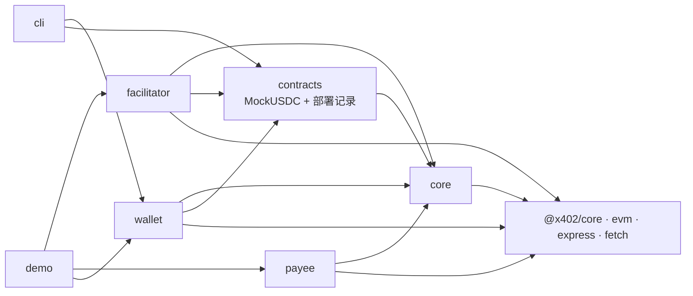
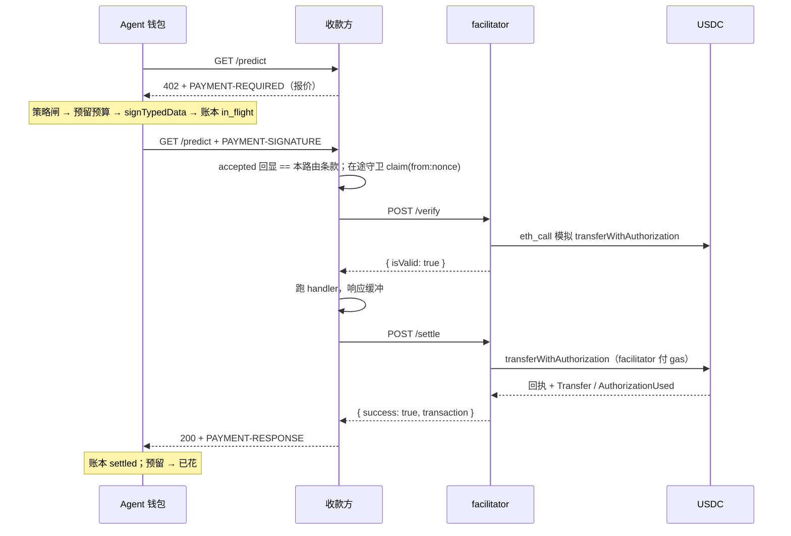

# agentpay 技术报告

> 版本：分支 `x402`（2026-09-19），x402 迁移完成后的第一版。适用读者：接入或维护这套支付系统的工程师。AEP2 时代的最后一版代码在 tag `aep2-final`。

## 1. 摘要

agentpay 是一套给 AI agent 用的支付系统：协议是 Coinbase 的 **x402 V2，`exact` scheme**（EIP-3009 `transferWithAuthorization`），实现用官方 `@x402/*` 包；agentpay 自己加的是**付款方的预算层**、一个可自建的 facilitator、收款方的 paywall 封装、给 LLM agent 的 CLI + SKILL.md，以及一条本地链上跑通全流程的 demo。

一笔付款：agent 请求收费接口 → 402（`PAYMENT-REQUIRED` 头里是报价）→ 钱包过策略闸、预留预算、签一张**单次使用**的 USDC 授权 → 带 `PAYMENT-SIGNATURE` 重发 → 收款方让 facilitator 验证 → 跑业务 handler（响应先缓冲）→ facilitator 把授权广播上链、等回执 → 200 + `PAYMENT-RESPONSE`（交易哈希）。**每笔调用一笔链上交易，响应到达时钱已经到账。** 付款方只需持有 USDC，不需要 ETH、不需要存入合约、不需要 approve。

| 项目 | 现状 |
|---|---|
| 代码 | TypeScript ESM monorepo，6 个包 + demo；Solidity 只剩测试用 `MockUSDC.sol` |
| 协议 | x402 V2 / `exact` / EIP-3009，`@x402/core` `@x402/evm` `@x402/express` `@x402/fetch` ~2.26.0 |
| 链 | 本地 Hardhat 全流程；Base Sepolia 无需部署（Circle USDC + 托管 facilitator 的静态记录已提交，未实跑） |
| 测试 | 7 个工作区共 153 个测试，全绿；demo 10 个场景全过 |
| 集成 | 作为 git 子模块 `payment/` 挂在 Kairos 仓库；`face/` 尚未调用 |
| 不做 | V1、`upto`、Permit2、智能合约钱包签名、批量结算、争议、KYC、前端 |

## 2. 目标与范围

- **按 x402 生态来**：信封、facilitator API、客户端签名、收款方中间件都用官方实现，保证与托管 facilitator（`https://x402.org/facilitator`）和官方客户端（`@x402/fetch`）互通——demo 第 9 场景就是官方客户端付我们的 payee。
- **预算是 agentpay 的差异化**：官方客户端只管签；`MandateWallet` 只在人批过的 intent mandate 内签、签前同步预留、记账本、事后对链核对。
- **agent 优先的接入面**：一个 CLI 和一份 SKILL.md，让 agent 不碰私钥也能看报价、查预算、付款、对账。
- **明确不做**：x402 生态里的其它 scheme 与扩展，以及产品面。

## 3. 系统架构

### 3.1 四个角色

| 角色 | 包 | 持有 | 职责 |
|---|---|---|---|
| 付款方：agent 钱包 | `packages/wallet`、`packages/cli` | 付款私钥（EOA 里就是 USDC）、用户批准的预算（intent mandate）、本地账本 | 收到 402 后过策略闸、签授权、记账、事后对账 |
| 收款方：数据源 | `packages/payee` | 收款地址、报价、facilitator 地址 | 出 402 报价、让 facilitator 验证、跑 handler、让 facilitator 结算、回 `PAYMENT-RESPONSE` |
| facilitator | `packages/facilitator`（或 x402.org 托管） | facilitator 私钥（付 gas） | 验证授权、广播 `transferWithAuthorization`、等回执 |
| 链上 | `packages/contracts` | USDC（EIP-3009）：余额、`authorizationState(from, nonce)` | 唯一动钱的地方；我们没有自己的合约 |

`packages/core` 是共用底座：金额与 CAIP-2 工具、EIP-3009 ABI 切片、错误码、`payment_model_context` 提示；协议类型从 `@x402/core/types` 再导出。`demo/` 在一个进程里把四方跑一遍。

### 3.2 依赖方向



运行时三方（facilitator、payee、wallet）互不导入，只通过 HTTP 和链交互。

### 3.3 一笔付款的时序



## 4. 协议与数据格式

全部是 x402 V2 的形状，由 `@x402/core/http` 编解码；本项目在协议之外只加了两样：首次 402 的 JSON body 带 `payment_model_context`，钱包返回的 Response 带 `x-agentpay-nonce` / `x-agentpay-ledger-status`。

### 4.1 报价（402）

`PAYMENT-REQUIRED` = base64 JSON：

```
PaymentRequired { x402Version: 2, error?, resource: { url, description?, mimeType? }, accepts: PaymentRequirements[] }
PaymentRequirements { scheme: 'exact', network: 'eip155:<id>', amount, asset, payTo, maxTimeoutSeconds, extra: { name, version, assetTransferMethod: 'eip3009' } }
```

`extra.name/version` 是 token 的 EIP-712 域（MockUSDC：`Mock USD Coin`/`2`；Base Sepolia USDC：`USDC`/`2`）。`maxTimeoutSeconds` 决定授权的存活期（默认 60 s）。V2 的默认 body 是 `{}`，我们的 paywall 用 `unpaidResponseBody` 放入 `payment_model_context`。

### 4.2 单次授权

官方客户端生成并签名：

```
TransferWithAuthorization(address from, address to, uint256 value, uint256 validAfter, uint256 validBefore, bytes32 nonce)
域 { name, version, chainId, verifyingContract: asset }
from = 付款人；to = payTo；value = amount；validAfter = 0；validBefore = now + maxTimeoutSeconds；nonce = 随机 32 字节
```

`PAYMENT-SIGNATURE` = base64 `{ x402Version: 2, resource, accepted: <报价>, payload: { signature, authorization } }`。同一个 `(from, nonce)` 链上只能用一次。

### 4.3 结算响应

`PAYMENT-RESPONSE` = base64 `{ success, transaction, network, payer?, errorReason?, errorMessage? }`。成功时 `transaction` 是已上链的交易；结算失败时 `@x402/express` 回 402 且头里 `success: false` 带 `errorReason`；`settlement_pending` 表示已广播但没等到回执，带交易哈希。

### 4.4 facilitator API

`GET /supported` → `{ kinds: [{ x402Version: 2, scheme: 'exact', network }], extensions, signers }`；`POST /verify` / `POST /settle` 收 `{ x402Version: 2, paymentPayload, paymentRequirements }`，语义上的拒绝仍是 HTTP 200（`isValid: false` / `success: false`），结构错误 400 `invalid_body`，链不可达 503 + `Retry-After`。

### 4.5 错误码

以 `@x402/evm` 的实现为准（与规范文档的词汇不同）：`invalid_exact_evm_signature`、`invalid_exact_evm_recipient_mismatch`、`invalid_exact_evm_payload_authorization_valid_before` / `_valid_after` / `_value_mismatch`、`invalid_exact_evm_missing_eip712_domain`、`invalid_exact_evm_network_mismatch`、`invalid_exact_evm_insufficient_balance`、`invalid_exact_evm_nonce_already_used`、`invalid_exact_evm_transaction_simulation_failed`、`invalid_exact_evm_transaction_failed`、`asset_not_deployed_contract`、`settlement_pending`。收款方自己的：`payment_required`（首次 402）、`replay`（在途守卫）、`settlement_unavailable`（facilitator 不可达/超时/5xx）。付款方策略：`mandate_required`、`mandate_not_found`、`no_eligible_mandate`、`mandate_insufficient_budget`、`mandate_expired`、`mandate_disabled`、`host_not_allowed`、`per_call_max`、`rate_limited`、`unsupported_offer`、`timeout_too_long`。每个码都有 `payment_model_context` 提示（`core/src/hints.ts`），测试保证不漏。

## 5. 链上

没有我们自己的合约。付款方的 USDC 在它的 EOA 里，facilitator 用 `(v, r, s)` 重载调 `transferWithAuthorization`。

- `packages/contracts/contracts/MockUSDC.sol`：测试用 EIP-3009 token（`transferWithAuthorization` / `receiveWithAuthorization` / `authorizationState`，OpenZeppelin `EIP712`，域 `Mock USD Coin`/`2`，开放 `mint`）。只在本地链用。
- `deployLocalFixture()`：MockUSDC + 用 `hardhat_setCode` 放到规范地址 `0xcA11…CA11` 的 **Multicall3** 字节码——`@x402/evm` 在模拟失败后靠它诊断精确原因（余额不足、nonce 已用、域不匹配），没有它本地只能得到笼统的 `..._simulation_failed`。
- 部署记录 `DeploymentRecord { chainId, network, usdc, usdcDomain: { name, version }, facilitatorUrl?, ... }`：`localhost.json` 由 `deploy:local` 生成（gitignored）；`base-sepolia.json` 是提交的静态记录，域已按链上 `DOMAIN_SEPARATOR()` 核对。缺 `usdcDomain` 的旧记录会被 `assertDeploymentRecord` 拒绝。
- Gas：`transferWithAuthorization` 每笔约 6–8 万 gas，由 facilitator 付；Base 上一次付费调用约 2–4 s（一个块 + 回执轮询），本地 automine 约 50 ms。

## 6. facilitator

`packages/facilitator`，无状态 `node:http` 服务，核心是 `@x402/core` 的 `x402Facilitator` 加 `@x402/evm/exact/facilitator` 的 `ExactEvmScheme`，只注册 V2、一条链（直接 `register` 而不用 `registerExactEvmScheme`，后者会把 V1 也挂到它认识的所有网络上）。

- **签名器**：`privateKeyToAccount(key, { nonceManager })` + `createWalletClient(...).extend(publicActions)`，`pollingInterval` 显式设 500 ms（viem 默认按 `blockTime ?? 12 s` 取 4 s 轮询，Base 2 s 出块会白等）。`writeContract` / `sendTransaction` 包在一个**发送锁**里：viem 在 gas 估算之前就消费 nonce、任何失败都 `reset`，Hardhat automine 对乱序 nonce 报 "Nonce too high"，串行化广播（回执仍并行等）后 20 个并发结算稳定。`simulateInSettle: true`：广播前再模拟一次，revert 不消耗 nonce。
- **签名离线验证**：EOA 签名先用 viem 离线 `verifyTypedData`，只有失败时才走链上（EIP-1271/6492）；否则 RPC 一抖，scheme 会把好签名报成 `invalid_exact_evm_signature`。
- **传输错误计数**：signer 的每个链调用统计 transport 类失败；HTTP 层对比调用前后的计数，把 scheme 折叠成"拒绝"的 RPC 故障改答 **503 `unexpected_verify_error` / `unexpected_settle_error` + `Retry-After`**（`settlement_pending` 保留原样）。
- **白名单**：`tokens`（必填）与 `payees`（可选）在 `onBeforeVerify` / `onBeforeSettle` 钩子与 HTTP 层各拒一次；`/settle` 是公开端点、替人付 gas，公网上没有 `PAYEES` 等于任何人都能让它烧钱。可选 `FACILITATOR_AUTH_TOKEN`（Bearer）。
- **启动检查**：RPC 可达且 chainId 一致；每个 token 能答 `authorizationState`；`assetDomain` 与合约的 `eip712Domain()`（OpenZeppelin）或 `name()/version()/DOMAIN_SEPARATOR()`（Circle）重算一致；EOA 有 ETH。域错了启动即失败，而不是每笔 `invalid_exact_evm_signature`。
- 配置见 `.env.example`：`FACILITATOR_PK`、`RPC_URL`、`CHAIN_ID`/`SUPPORTED_TOKENS`/`USDC_DOMAIN_*`（缺省来自部署记录）、`PAYEES`、`FACILITATOR_PORT`、`RECEIPT_TIMEOUT_MS`（30 s，不是 viem 的 180 s：授权本身只活 `maxTimeoutSeconds`）。

## 7. 收款方 paywall

`createPaywall(options)` 建一个 `x402ResourceServer`（`HTTPFacilitatorClient` + `ExactEvmScheme`，一条链、V2），`charge(price, opts)` 返回 `@x402/express` 的 `paymentMiddleware`，挂在某条路由上。中间件的行为是官方的：无支付 → 402；有 → `findMatchingRequirements`（`accepted` 回显必须等于本路由条款）→ `/verify` → `next()`，`res.write/res.end` 被缓冲 → handler 状态 ≥ 400 则取消结算 → `/settle` → 设 `PAYMENT-RESPONSE` 后才把缓冲的响应发出去；结算失败 → 402（头里 `success:false`）。

agentpay 加的：

- 非默认资产（MockUSDC，或 scheme 不认识的链上的 USDC）必须以 `AssetAmount { asset, amount, extra: { name, version, assetTransferMethod } }` 报价，否则官方 server 找不到资产信息。
- **在途守卫**（`IdempotencyStore`，键 `from:nonce`，服务端 TTL = `maxTimeoutSeconds + 60`）：`onBeforeVerify` 先 `claim`，重复在途 → abort `replay`；`onAfterVerify`（`isValid:false`）/ `onVerifyFailure` / `onSettleFailure` / `onVerifiedPaymentCanceled` 释放；`onAfterSettle` 成功后 `retain`，重放不再打 facilitator。同一个 paywall 的所有路由共享一个 store，所以同一授权并发打两条同价路由也只服务一次。
- facilitator 抛出的错误（不可达、超时、5xx）在 `onVerifyFailure` / `onSettleFailure` 里 `recovered` 成干净的原因码：`settlement_unavailable`，或 facilitator 自己 5xx 里给的 `invalidReason` / `errorReason`。否则客户端看到的是异常文本。
- 首次 402 的 body：`{ x402Version: 2, error: 'payment_required', message, payment_model_context }`（`includeHints: false` 可关）。verify 失败的 402 body 固定 `{}`，原因在头的 `error` 字段——这是官方实现的行为，钱包据此读原因。

配置：`facilitator { url, timeoutMs (默认 35 s ≥ facilitator 的回执超时), authToken? }`、`network`、`asset`、`assetDomain`、`payTo`、`maxTimeoutSeconds`（默认 60）、`onSettled`。

## 8. 付款方钱包

`MandateWallet` 是一个 `fetch` 包装器加预算与账本管理；协议动作委托给 `x402Client`（`setSpendControls(false)`——官方默认会拒绝非默认资产并封顶 $1/笔，策略闸就是我们的 spend control）与 `x402HTTPClient`。不用 `wrapFetchWithPayment`：它把我们的 `PolicyViolation` 包成普通 Error。

### 8.1 预算：intent mandate（未变）

用户批准的额度，链下 EIP-712 凭证（域 `AEP2AgentWallet` v1——名字沿用，改了会让所有已签预算卡失效）：`IntentMandate(id, naturalLanguage, limitAmount, validFrom, validUntil, hostAllowlist, category)`。字段 `limitAmount`、`spentAmount`、`pendingSpentAmount`、`perCallMax?`、`maxCallsPerMinute?`、`hostAllowlist`、`validFrom/validUntil`、`status: draft | signed`、`isEnabled`。agent 只能 `createIntentMandate` 生成 draft；批准、启用、加额是人的操作。两个计数器是账本的缓存，加载时从账本重算。

### 8.2 策略闸（未变）

已签名 → 已启用 → 在有效期 → host 在白名单 → 不超单笔上限 → `limit − spent − pending ≥ amount` → 未超每分钟次数。自动选择的拒绝理由优先级 `host_not_allowed > mandate_expired > per_call_max > mandate_insufficient_budget > rate_limited > mandate_disabled`。

### 8.3 选报价

`accepts` 里必须有：`scheme === 'exact'`、`network` 与钱包一致、`asset` 是钱包的 token、`extra.name/version` **等于钱包配置的域**（不信报价）、`maxTimeoutSeconds ≤ caps.maxAuthorizationValiditySeconds`（默认 300；这就是失败调用的预算会被占用的上限）。否则 `unsupported_offer` / `timeout_too_long`，签名前就拒。

### 8.4 `fetch()` 流程

1. 首个请求拿 402（`prepay: true` 且有缓存报价则直接带支付）；V2 只读 `PAYMENT-REQUIRED` 头。
2. 策略闸 + 预留，**一个同步块**内完成。
3. `client.createPaymentPayload()` 签名（失败 → 释放预留）；签完立刻追加账本行 `in_flight`（`v: 2`，键 `nonce`，记 `validBefore`、`authorization`、`signature`、`signedAt`）。
4. 带 `PAYMENT-SIGNATURE` 重发。传输错误在 `validBefore − 10 s` 之前**重发同一个头**最多 2 次（同 nonce 至多结算一次），仍失败 → `unknown`（httpStatus 0）并抛出，预留保持。
5. 结果由 `PAYMENT-RESPONSE` 决定：
   - `success && transaction` → `settled`，`pending −amount, spent +amount`。**任何 HTTP 状态**下都如此：结算后 handler 5xx 记 `settled` + `error: 'paid but http 500'`。
   - 2xx 但无头/坏头/`success:false` → `unknown`，算已花（是否被扣款不可知，多算是安全方向）。
   - 非 2xx 且头里 `settlement_pending` → `unknown` 带交易哈希，预留保持。
   - 其它非 2xx → `rejected`，`error` 取 `PAYMENT-REQUIRED.error`，否则结算的 `errorReason`，否则 body 的 `error`，否则 `http N`；**预留保持**——授权在 `validBefore` 前仍可能被结算。
6. 返回重包装的 Response，加 `x-agentpay-nonce` / `x-agentpay-ledger-status`。

### 8.5 对账

`reconcile()` **按链时间**判断，不看墙钟：先 `getChainId()`（与配置不符直接抛错）和 `getBlock()`，对 `rejected | unknown` 行在该块读 `authorizationState(payer, nonce)`：已用 → `settled`（交易哈希尽力从 `AuthorizationUsed(authorizer, nonce)` 日志找，范围按 `signedAt` 与 `BLOCK_TIME_SECONDS` 倒推、Hardhat 从 0 起）；未用且 `block.timestamp ≥ validBefore` → `expired-unused`（此后每个块都会 revert，无需宽限），释放预留或退回已花；否则继续 pending。头里报过 `settled` 的行在有效期过后各查一次：链上没用过 → 退回预算并记 `expired-unused`（收款方谎报）。RPC 传输错误 → 该行及之后全部保持 pending；其它错误记在该行 `error` 上继续。`rebuildBudgets` 与 `reservationHeld` 语义不变：`rejected` 与 httpStatus 非 2xx 的 `unknown` 持有预留；`settled` 与 2xx 的 `unknown` 算已花；`expired-unused` 两者都不算。

### 8.6 链上操作

只剩 `balance()`（`balanceOf(owner)`；超过 `caps.floatWarnAtomic` 打日志提醒 EOA 只放小额浮动资金）。`rpcUrl` 可选：`pay` 完全离线签名。

## 9. CLI 与 agent 接入

`agentpay <command>`，每条命令恰好输出一份 JSON。退出码：`0` 成功，`1` 业务拒绝（读 `error` 与 `payment_model_context`），`2` 用法或配置错误。金额参数一律是美元。

| 组 | 命令 |
|---|---|
| 钱包 | `address`（打钱地址，不需要 ETH）`balance` |
| 预算 | `mandate-request` `mandate-create` `mandate-approve` `mandate-enable` `mandate-disable` `mandate-list` `mandate-status` |
| 付款 | `offer <url>` `pay <url> [--method --body --header --mandate --prepay]` `ledger` `reconcile` `report` |
| 设置 | `init [--from-deployment localhost\|base-sepolia\|path.json]` |

`pay` 输出 `payment: { transaction, network, payer, nonce, intentMandateId, amount, ledgerStatus }`（按 `x-agentpay-nonce` 找账本行）；`paid` 只在 `ledgerStatus === 'settled'` 时为 true；`unknown` 时附 `payment_model_context`（先 `reconcile` 再付）。配置优先级：命令行参数 > `AGENTPAY_*` 环境变量 > `$AGENTPAY_HOME/config.json` > 部署记录；token 的域随 token 走（`AGENTPAY_TOKEN_NAME/VERSION`，或部署记录）。`SKILL.md` 的决策流程：`offer` 看价 → `mandate-list` 找预算 → 没有就 `mandate-request` 起草并停下等人批 → `pay` → 被拒读 `remediation`；结果 `unknown` 时先 `reconcile`。

## 10. 安全模型与信任边界

| 谁信谁 | 内容 | 若失信 |
|---|---|---|
| 付款方 → 收款方 | 结算后会交付 | `authorization` 流先 handler 后 settle：handler 失败不收钱；但 settle 成功后 handler 仍可能 5xx（账本 `paid but http 500`），无追索 |
| 付款方 → 收款方/facilitator | 已签出的授权只在 `validBefore` 前、只按 `to`/`value` 使用 | 被拒的调用其授权仍活着：预算保留到链时间过期，`reconcile` 释放 |
| 收款方 → facilitator | `success:true` 是真的 | 我们的 facilitator 等回执并验 `Transfer` 事件；收款方不自查链 |
| 付款方 → 收款方的 `PAYMENT-RESPONSE` | 报的交易是真的 | 有效期过后 `reconcile` 查一次 `authorizationState`，谎报的退回预算 |
| 用户 → 钱包程序 | 预算只在链下由钱包遵守 | **USDC 在 EOA 里，拿到私钥的人一次 `transfer` 就能转空**；预算约束 agent，不约束密钥 |

设计上的防线：钱包钉住 token 域、封顶授权存活期、签前预留；收款方在途守卫、回显条款校验（官方）；facilitator 白名单、离线验签、Bearer、启动域校验。未覆盖：私钥仍以环境变量/`config.json`（0600）形式存在；没有 KMS seam；facilitator 没有限流。

## 11. 可靠性与一致性

| 进程在这里崩溃 | 结果 |
|---|---|
| 钱包：预留后、账本行写入前 | `mandates.json` 多一笔 pending 而账本没行；下次加载从账本重算，预留释放 |
| 钱包：签名后、发请求前 | 账本有 in_flight 行，预算已预留；`reconcile` 按链上状态收敛（用了 → settled；过期 → 释放） |
| 钱包：提交后、账本更新前 | `mandates.json` 已记 spent 而账本还是 in_flight；重算为 pending（只算一次），对账后收敛 |
| 收款方：verify 后、settle 前 | 未结算，付款人未被扣款；在途 claim 随 TTL 过期 |
| 收款方：settle 请求发出后断线 | facilitator 可能已广播：官方 `PendingSettlementStore` 让同一授权的重试拿回同一笔 tx；付款人账本 `unknown`/`rejected` 由 `reconcile` 纠正 |
| facilitator：广播后、回执前超时 | 答 `settlement_pending` + 交易哈希；收款方回 402，付款人多半已被扣款，`reconcile` 记 settled |
| 钱包对账时 RPC 不可用 | 快速失败，不改任何状态 |

存储：钱包 `mandates.json`（单写者，tmp+fsync+rename）与 `ledger.jsonl`（只追加、每行 fsync；状态更新 tmp+fsync+rename；只容忍截断的尾行；`v: 2` 行，AEP2 时代的行拒绝加载并提示归档），收款方在途守卫在内存（带 TTL），facilitator 无存储。

## 12. 测试与验证

| 工作区 | 测试数 | 覆盖 |
|---|---|---|
| core | 10 | 金额、CAIP、nonce 格式、ABI 切片、每个原因码都有提示 |
| contracts | 12 | MockUSDC 元数据与域、EIP-3009 转账/重放/过期/未生效/错签名/余额不足（整笔 revert、nonce 不消耗）、`receiveWithAuthorization` 调用者、Multicall3 已就位 |
| facilitator | 35 | verify 各原因（含 Multicall3 精确诊断）、settle 转账/去重/12 并发 nonce 连续/不广播的拒绝/RPC 故障 503 与恢复、HTTP 面（400/401/404/405/413、V1 拒绝）、配置、启动检查（链 id、非 EIP-3009、域错、无 ETH、RPC 不可达） |
| payee | 22 | 402 形状与提示、支付流程、本地重放、并发同授权（同路由与跨路由）、回显篡改、facilitator 拒绝/宕机/超时/5xx/`settlement_pending`、handler 失败不结算、settle 失败 402；真 facilitator + 官方 `@x402/fetch` 客户端上链付通 |
| wallet | 59 | 策略闸每个理由（含域不匹配、`timeout_too_long`）、并发预留、账本（v2、拒绝 AEP2 行、耐久序列）、结算报告各分支、传输错误重发同头、崩溃窗口重算、prepay、report；链上：真 facilitator 付款、链下结算后对账、链 id 守卫、链时间过期释放与谎报退款 |
| cli | 12 | 命令 JSON 契约、配置（token 域必填、无 RPC 时 `pay` 可用）、`offer`/`pay`/拒绝/`unknown` 提示、stderr 修复日志 |
| demo | 3 | 端到端 |

测试基础设施：每个需要链的包在 vitest global-setup 里各起一个 Hardhat 节点（8546 contracts、8547 facilitator、8548 payee、8549 wallet），`deployLocalFixture` 部署 MockUSDC + Multicall3；账户 #0 部署者、#1 付款人、#2 收款人、#3 facilitator、#4 陌生人。demo 用 8545 / 3001 / 4021。

demo 的 10 个场景：同一调用内链上余额变动；V2 报价 + 提示；预算拒绝；重放（payee 本地拒 + facilitator 报 nonce 已用）；facilitator 拒绝（无余额、回显篡改）；handler 失败不扣款；20 并发 = 20 笔交易、nonce 连续；延迟采样（本地约 45 ms/次）；官方 `@x402/fetch` 客户端付通；**最后**时间旅行：链时间过期释放预留、早先结算被确认。

命令：`npm test`、`npm run demo`、`npm run typecheck`、`npm run gen-abi && git diff --exit-code packages/contracts/src/abi.ts`。

## 13. 部署与运维

- **本地**：`npx hardhat node` → `npm run deploy:local`（MockUSDC + Multicall3，写 `localhost.json` 含 `usdcDomain`）→ `FACILITATOR_PK=… npm run facilitator` → `npm run payee` → `npm run cli -- …`。
- **Base Sepolia**：不部署任何东西。payee 指向 `FACILITATOR_URL=https://x402.org/facilitator`（`/supported` 已确认含 `{x402Version:2, scheme:'exact', network:'eip155:84532'}`），付款 EOA 只需测试 USDC；自建 facilitator 需要有 Sepolia ETH 的 `FACILITATOR_PK` 并设置 `PAYEES`。
- **约束**：facilitator 的 `RECEIPT_TIMEOUT_MS` < payee 的 `facilitator.timeoutMs`；payee 的 `maxTimeoutSeconds` ≤ 付款方钱包的 `maxAuthorizationValiditySeconds`（默认 60 vs 300）；同一 `AGENTPAY_HOME` 只跑一个钱包进程；AEP2 时代的 `ledger.jsonl` / 旧部署记录要归档重来。

## 14. 与 x402 参考实现的差异（有意为之）

1. **客户端前面有预算**：官方客户端叫签就签；`MandateWallet` 只在已批准的 intent mandate 内签，签前预留，记账并对账。官方 spend controls 关闭，由策略闸替代。
2. **钱包钉住 token 域**，不信报价里的 `extra.name/version`。
3. **收款方在途守卫**：参考中间件在首次结算未完成时会把同一授权服务两次（同路由或同条款的另一路由）；`createPaywall` 在 verify 前 claim `from:nonce`。
4. **facilitator 加固**：白名单、Bearer、EOA 离线验签、RPC 故障答 503 而不是 `invalid_exact_evm_signature`、发送锁。
5. **只做 V2、`exact`、EIP-3009**。

## 15. 已知限制

- **托管风险变了**：USDC 在 EOA，私钥即全部余额；预算卡只约束 agent。建议小额浮动 + 冷钱包补充。
- handler 跑完但 settle 失败 → 客户端 402、工作已做完（`authorization` 流固有）；settle 成功后 handler 5xx → 付了没拿到货，无追索。
- 被拒/丢失的调用把预算占到授权过期（`maxTimeoutSeconds`，钱包封顶 300 s）；收款方在此窗口内仍能结算它。
- facilitator 广播后超时 → `settlement_pending`，付款方多半被扣、收款方已回 402；账本靠 `reconcile` 纠正；pending 去重只在 facilitator 进程内。
- 自建 facilitator 在真实网络上没有卡住交易的替换逻辑（nonce manager 会排队；重启重同步）。
- 多进程共用一个 `AGENTPAY_HOME` 的预算竞争未改；链上支付图公开；USDC 可被发行方冻结；MockUSDC 开放 mint。
- 没有 KYC、争议、支付链接、UI。

## 16. 与 Kairos 的集成现状

- agentpay 仓库：`https://github.com/linqizhe07/agentpay`（`main` 常绿，改动走 PR）；本次迁移在分支 `x402`，AEP2 最后一版是 tag `aep2-final`。
- Kairos 仓库 `KairosPan/Evolving-Alpha-US`：子模块 `payment/` 仍钉在 AEP2 版本；合并 `x402` 后需要升级子模块指针，并按 §13 的约束配置（付款 EOA 放 USDC、payee 指向 facilitator）。
- Kairos 是付款方。agent 的接入面是 `agentpay` CLI + `SKILL.md`；`face/` 与 `dsh/` 尚未调用它。

## 17. 建议的后续工作

1. Base Sepolia 实跑：payee 对接托管 facilitator，记录真实延迟与失败率；再用自建 facilitator 跑一遍，证明两种 facilitator 吃同一份 `PAYMENT-SIGNATURE`。
2. 在 Kairos 里真正接入：MCP server 包装 CLI，人批预算的卡片复用现有审批模式；付款 EOA 的浮动资金策略。
3. 钱包：预算文件加锁或改为单进程守护；对账定时执行；密钥走 KMS/宿主签名器（`ClientEvmSigner` 只需要 `signTypedData`，换起来是一处）。
4. facilitator：限流；Base 上卡住交易的替换；指标。
5. 若单价降到亚分级、频率高到每笔一块等不起：x402 也有 `batch-settlement` scheme 槽位，`aep2-final` 的代码可作为其 network binding 复活。

## 附录 A：文件索引

| 路径 | 内容 |
|---|---|
| `packages/core/src/{types,errors,hints,money,caip,ids,eip3009}.ts` | 底座：类型再导出、错误码与提示、金额、CAIP、EIP-3009 ABI 切片 |
| `packages/contracts/contracts/MockUSDC.sol`，`src/{deploy,deployments,multicall3,abi}.ts`，`deployments/base-sepolia.json` | 测试 token、本地夹具、部署记录 |
| `packages/facilitator/src/{facilitator,server,chain,config,index,main}.ts` | facilitator |
| `packages/payee/src/{paywall,store,types}.ts`，`examples/express.ts` | 收款方 |
| `packages/wallet/src/{wallet,policy,mandate-store,ledger,durable,hosts}.ts` | 钱包 |
| `packages/cli/src/{cli,config,amounts,output,context}.ts`，`commands/*`，`SKILL.md` | CLI |
| `demo/src/{run-demo,facilitator,payee,chain,accounts,util}.ts` | 端到端演示 |
| `README.md`、`.env.example` | 用法与配置 |

## 附录 B：术语

| 术语 | 含义 |
|---|---|
| x402 | Coinbase 的 HTTP 402 支付协议；本项目用 V2、`exact` scheme |
| exact / EIP-3009 | 付款人签 `TransferWithAuthorization`，任何人可替他广播，转账精确等于 `amount` |
| facilitator | 验证授权并广播结算、付 gas 的服务；可自建或用托管的 |
| authorization | 一次性、EIP-712 签名的转账授权；`(from, nonce)` 链上只能用一次 |
| intent mandate | 用户批准的链下预算 |
| validBefore | 授权过期的 unix 秒；等于 `now + maxTimeoutSeconds` |
| settled / rejected / unknown / expired-unused | 钱包账本四态：已结算 / 被拒（预留保持）/ 不知是否被扣 / 链时间过期未用 |
| Multicall3 | facilitator 用来诊断模拟失败原因的合约；本地用 `hardhat_setCode` 放入 |
